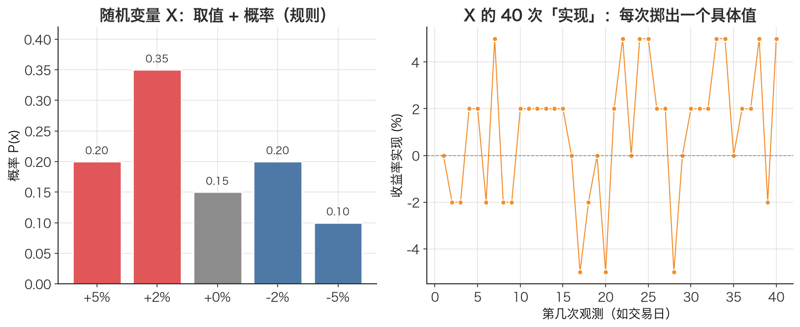

# 随机变量 Random Variable

> 把「明天涨还是跌」这种说不准的事，变成一个能算、能加权、能求期望的数字 X——这就是随机变量。

## 1. 探底 · 确认前置知识

随机变量是本章节的起点，**没有显式前置数学概念**。但需要具备以下基础（都属高中/编程常识）：

- 基本函数与求和符号 $\sum$：自测题——$\sum x_i \cdot P_i$ 中如果有 3 项，展开是什么？（答：$x_1 P_1 + x_2 P_2 + x_3 P_3$）
- 编程里的「字典 / 键值对」直觉：自测题——该怎么用一个 `dict` 表示「结果→概率」的映射？
- 百分比与小数互换：自测题——`+5%` 写成小数是多少？（答：`0.05`）

如果以上都没问题，就可以开始了。随机变量是后面学 [期望值 Expected Value](./ch01-03-expected-value.md)、[方差 Variance](./ch01-04-variance.md)、[概率分布 Probability Distribution](./ch01-02-probability-distribution.md)的地基。

## 2. 建立动机 · 为什么需要它？

假设要写一个回测脚本，想回答一个简单问题：**「这只股票明天的收益率，该预期是多少？」**

作为工程师，很自然的第一反应是「取历史平均」。但这里藏着一个陷阱：这等于把「明天的收益率」当成了一个**确定的数**，可它根本不是——明天可能大涨、可能大跌、可能平盘。它是一个**不确定的量**。

如果不先把这个「不确定的量」形式化，后面所有的统计（期望、方差、波动率、夏普比率）都没有立足点。到那时，代码里写着 `mean(returns)`、`std(returns)`，却说不清这些数到底在描述什么对象。

随机变量就是那个被描述的对象。先把「明天的收益率」定义成一个随机变量 X，「期望」「方差」才有意义——它们都是关于 X 的运算。缺了这一步，就像没定义变量就开始算它的统计量。

## 3. 建立直觉 · 它「感觉上」是什么？

把随机变量想象成一台**还没掷出去的骰子**。

- 骰子有 6 个面，每个面是一个**可能的结果**（1 到 6）。
- 每个面出现的可能性是它的**概率**（公平骰子是 1/6）。
- 「随机变量 X」= 这台骰子本身（这个「还没确定、但有一套可能取值和对应概率」的整体）。
- 「X 的一次取值」= 真的掷了一次，看到朝上的那个数（比如掷出了 4）。

关键区分：**X 是「会取值的规则」，不是某一次具体的值。** 在代码里打个比方：X 像一个函数 `roll()`，每次调用返回一个随机数；而某次调用的返回值 `4` 只是一次实现（realization）。

放到交易里：「沪深300明天的收益率」就是一个随机变量。它的「面」是各种可能的涨跌幅，每个涨跌幅有对应概率。今天收盘后这个变量还没「掷出」；明天收盘，它实现为一个具体值，比如 `+0.8%`。



*图：左边是随机变量 X 的「规则」（取值 + 概率分布）；右边是从这个分布反复采样得到的一串「实现」。X 是那台还没掷出的骰子，每个点才是掷出的结果。*

## 4. 给出定义 · 它精确是什么？

**离散随机变量**由两部分组成：一组可能取值，以及每个取值对应的概率。

记随机变量为 X，它的可能取值为 $x_1, x_2, \dots, x_n$，对应概率为 $P(x_1), \dots, P(x_n)$。这组「取值 → 概率」的对应关系就叫它的**概率分布**（见 [概率分布 Probability Distribution](./ch01-02-probability-distribution.md)）。它必须满足两条公理：

1. 非负性： $P(x_i) \ge 0$ ——每个概率不能为负
2. 归一性： $\sum P(x_i) = 1$ ——所有概率加起来等于 1

符号逐一解释：

- **X**：随机变量本身（大写），代表「那个不确定的量」，无单位（单位由它代表的事物决定）。
- $x_i$：第 i 个可能取值（小写），是一个确定的数。本文里 $x_i$ 是「收益率」，单位是「无量纲的比率」（如 0.05 表示 +5%）。
- $P(x_i)$：X 取值为 $x_i$ 的概率，是一个 0 到 1 之间的纯数。
- **i**：下标，从 1 到 n，遍历所有可能结果。
- $\sum$：求和符号，对所有 i 累加。

本文用的正是这套记号。一旦有了分布，就能定义它的期望 $\mathbb{E}[X] = \sum x_i \cdot P(x_i)$（见 [期望值 Expected Value](./ch01-03-expected-value.md)）和方差 $\operatorname{Var}[X] = \sum (x_i - \mu)^2 \cdot P(x_i)$（见 [方差 Variance](./ch01-04-variance.md)），但那是下游概念，这里只需记住：**随机变量 = 取值集合 + 概率分布**。

## 5. 例题演算 · 手把手算一遍

设某股票明天的收益率是随机变量 X，分布如下：

| 结果 | 概率 P(xᵢ) | 取值 xᵢ（收益率） |
|------|-----------|------------------|
| 大涨 | 0.20 | +0.05 |
| 小涨 | 0.35 | +0.02 |
| 平盘 | 0.15 | 0.00 |
| 小跌 | 0.20 | -0.02 |
| 大跌 | 0.10 | -0.05 |
| **合计** | **1.00** | |

**第一步：验证这是不是合法的随机变量（检查两条公理）**

- 非负性：0.20, 0.35, 0.15, 0.20, 0.10 全部 $\ge 0$ ✓
- 归一性：$0.20 + 0.35 + 0.15 + 0.20 + 0.10 = 1.00$ ✓

**第二步：算一个具体问题——「明天收益率为正」的概率是多少？**

正收益对应「大涨」和「小涨」两个结果：

$$\begin{aligned}
P(X > 0) &= P(+0.05) + P(+0.02) \\
         &= 0.20 + 0.35 \\
         &= 0.55
\end{aligned}$$

**最终答案：明天收益率为正的概率是 0.55（即 55%）。**

注意我们这一节**只用到了随机变量本身（取值+概率）**，还没碰期望、方差。期望值 $\mathbb{E}[X] = 0.008$ 的算法留给 [期望值 Expected Value](./ch01-03-expected-value.md) 那一篇——它正是建立在这个随机变量之上的运算。

## 6. 你来做 · 即时练习

用上面那张分布表（或自己设计）作答，答案在文末折叠区。

1. **[简单]** 上表中，「明天收益率为负」的概率 $P(X < 0)$ 是多少？
2. **[中等]** 抛一枚均匀硬币，正面记 $X=1$，反面记 $X=0$。写出 X 的完整概率分布表，并验证它满足两条公理。

答案见文末折叠区。

## 7. 深化 · 边界与反常识

- **X 不是某一次的值。** 最常见的误解是把随机变量和它的「一次实现」混为一谈。「昨天涨了 1%」是一次实现（一个确定数）；「明天会涨多少」才是随机变量。回测里看到的历史收益率序列，是 X 的**一串实现**，不是 X 本身。
- **期望值常常是不可能出现的取值。** 上例 $\mathbb{E}[X] = 0.008$（0.8%），但分布里根本没有「+0.8%」这个结果。期望是加权平均，不是「最可能发生的值」。这点在 [期望值 Expected Value](./ch01-03-expected-value.md) 里展开。
- **离散 vs 连续。** 本文用的是「离散随机变量」（有限个可能取值）。真实收益率其实是**连续**的（可以取任意实数），需要用概率密度函数描述。本文的处理方式是：把一段历史样本当成「等概率的离散分布」来近似——本文配套代码里 `eq_probs = [1.0/n]*n` 正是这个近似（每个历史日权重相同）。
- **与「事件」「概率」的区别。** 「明天大涨」是一个**事件**；「明天大涨的可能性 0.20」是一个**概率**；而把每个结果映射成数值并配上概率的整体，才是**随机变量**。随机变量是把「事件」翻译成「数」的桥梁，这样才能做算术。

## 8. 联系 · 它在数学地图里的位置

**上游依赖**：本概念是本文起点，无前置数学概念，只依赖基本的求和与百分比常识。

**下游用途**（都直接建立在随机变量之上）：

- [概率分布 Probability Distribution](./ch01-02-probability-distribution.md)——随机变量的「取值→概率」对应关系，是它的灵魂搭档。
- [期望值 Expected Value](./ch01-03-expected-value.md)——随机变量的加权平均 $\mathbb{E}[X] = \sum x_i P(x_i)$。
- [方差 Variance](./ch01-04-variance.md)与 [标准差 Standard Deviation](./ch01-05-standard-deviation.md)——刻画 X 围绕期望的离散程度，金融里 $\sigma$ 就是波动率。
- [样本均值 Sample Mean](./ch01-06-sample-mean.md)与 [贝塞尔校正（n-1） Bessel's Correction](./ch01-07-bessels-correction.md)——当我们用历史样本估计 X 的真实期望/方差时登场。
- 再往下，[简单收益率 Simple Return](./ch01-08-simple-return.md)、[对数收益率 Log Return](./ch01-09-log-return.md)都是「把价格变化定义成随机变量」的具体形式。

一句话定位：**随机变量是整张概率地图的根节点，几乎所有统计量都是对它的运算。**

## 9. 应用 · 量化与算法交易在哪里用它？

随机变量不是抽象玩具，它是量化建模的「第一行代码」。几个真实场景：

- **收益率建模（本文核心）。** 在本文配套代码的演示 1 里，把「某股票明日收益率」直接建成一个离散随机变量：

  ```python
  outcomes = [0.05,  0.02,  0.00, -0.02, -0.05]   # X 的可能取值 xᵢ
  probs    = [0.20,  0.35,  0.15,  0.20,  0.10]   # 对应概率 P(xᵢ)

  ev  = expected_value(outcomes, probs)   # 期望收益率
  sd  = std_dev(outcomes, probs)          # 波动率（风险）
  ```
  一旦把收益率看成随机变量，「期望收益」和「风险」就同时有了精确定义——这正是所有策略评估的起点。

- **历史数据 = 随机变量的样本。** 本文配套代码用沪深300真实数据（`adjust="qfq"` 前复权）时，把整段日对数收益率序列当成 X 的一批实现，用等概率近似其分布：

  ```python
  log_rets = np.log(close / close.shift(1)).dropna()  # 一串 X 的实现
  eq_probs = [1.0 / n] * n                              # 等概率离散近似
  ```
  注意收益率用 `close / close.shift(1)`——`shift(1)` 保证今天的收益率只用到今天和昨天的价格，**绝不引入未来数据**；在做交易信号时，信号也必须 `shift(1)` 延迟一天执行。

- **风控与情景分析。** 把「持仓明日盈亏」建成随机变量后，可以问「亏损超过 X 的概率有多大」（VaR 的雏形），或用蒙特卡洛对随机变量反复采样、模拟净值路径。
- **策略胜率建模。** 把「单笔交易结果」建成伯努利随机变量（赢=+a，输=−b，胜率 p），就能直接算策略的日期望收益与波动——这正是本文练习题 2 的内容。

## 10. 复盘 · 用输出倒逼输入

能脱稿回答下面三个问题，就证明你掌握了：

1. 随机变量 X 和它的「一次实现」有什么区别？各举一个交易里的例子。
2. 一个离散随机变量必须满足哪两条公理？如果概率之和是 1.1 会怎样（结合本文配套代码的 `expected_value` 会发生什么）？
3. 为什么说「随机变量是期望和方差的前提」？没有它，$\mathbb{E}[X]$、$\operatorname{Var}[X]$ 为什么无从谈起？

**费曼式复述任务**：用一句不超过 30 字的话，向一个只会写代码、不懂概率的朋友解释「什么是随机变量」。（参考答案：一个还没掷出的骰子——有一套可能的取值，每个取值带着自己的概率。）

---

<details>
<summary>第 6 节练习答案</summary>

1. 负收益对应「小跌」和「大跌」：$P(X < 0) = 0.20 + 0.10 = 0.30$，即 30%。（顺带验证：$P(>0)+P(=0)+P(<0) = 0.55 + 0.15 + 0.30 = 1.00$ ✓）

2. 分布表：

   ```text
   xᵢ      P(xᵢ)
   1       0.5
   0       0.5
   ```
   非负性：$0.5 \ge 0$ ✓；归一性：$0.5 + 0.5 = 1$ ✓。合法。这种只有 0/1 两个取值的随机变量叫「伯努利随机变量」，是描述「涨/跌」「胜/负」最常用的模型。

</details>