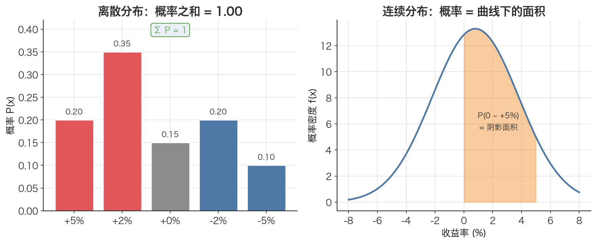

# 概率分布 Probability Distribution

> 随机变量回答「会发生什么」，概率分布回答「每件事发生的可能性有多大」——它是一张把所有可能结果和对应概率绑在一起的完整清单。

## 1. 探底 · 确认前置知识

读这篇前，请先确认懂下面这个概念。每条后面有一道一行自测题，答得出再往下读。

- [随机变量 Random Variable](./ch01-01-random-variable.md)：一个把「不确定的结果」映射成数字的变量。
  - 自测：「某股票明天的涨跌幅」是不是随机变量？它的取值是离散的还是连续的？

如果上面这题说不清「随机变量只是结果的数字化，本身不带概率信息」，请先回到 [随机变量 Random Variable](./ch01-01-random-variable.md)。概率分布正是给随机变量「补上概率」的那一步。

## 2. 建立动机 · 为什么需要它？

假设写了一个择时策略，回测里它「平均每天赚 0.8%」。听起来不错，于是上了实盘。

结果第一周就遇到一天暴跌 5%，账户回撤巨大，让人心慌，不禁自问：**这是策略坏了，还是本来就该发生的？**

光知道「平均 0.8%」回答不了这个问题。因为平均值把所有可能性压成了一个数字，丢掉了「单日跌 5% 的概率有多大」这个关键信息。

缺了概率分布，常会犯两类错：

- **低估尾部风险**：只看均值，不知道「极端坏结果」出现的频率，于是仓位上得过重，一次黑天鹅就爆仓。
- **无法计算期望与风险**：[期望值 Expected Value](./ch01-03-expected-value.md)、[方差 Variance](./ch01-04-variance.md)这些核心量，本质都是「对分布求加权」。没有分布，这些公式就是空壳。

概率分布就是把「所有结果 + 各自概率」一次性写清楚的那张表。有了它，期望、方差、风险度量才能算出来。

## 3. 建立直觉 · 它「感觉上」是什么？

把概率分布想象成一个**装了不同重量砝码的天平刻度**。

- 横轴是随机变量能取的所有值（比如收益率 +5%、+2%、0%、-2%、-5%）。
- 每个值上面压着一块砝码，砝码越重，这个结果越容易发生。
- 所有砝码的总重量恰好是 **1**（100%）——因为「某个结果一定会发生」。

对于**离散**随机变量（结果是可数的几种，比如骰子点数、上面那五档涨跌），分布就是一张表：每个值配一个概率，像柱状图一样一根根竖着。

对于**连续**随机变量（结果可以是任意实数，比如真实的日收益率 0.8137%…），分布是一条平滑曲线，看「曲线下某段面积」才是概率。

本文主要用**离散分布**来手算（因为它直观、能用纯 Python 实现），但思路对连续情形完全一样：**分布 = 把概率「分配」到各个可能结果上的规则。**



*图：左边是离散分布——一根根柱子，高度即概率，所有概率之和恰好为 1；右边是连续分布——平滑曲线，概率藏在「曲线下某段的面积」里。两者思路相同：把概率分配到各个可能结果上。*

## 4. 给出定义 · 它精确是什么？

一个**离散概率分布**，是把随机变量 X 的每个可能取值 xᵢ，对应到一个概率 P(xᵢ) 上的规则，满足两条公理：

1. **非负性**：每个概率都 $\ge 0$（对所有 i）

   $$P(x_i) \ge 0$$

2. **归一性**：所有概率加起来等于 1

   $$\sum P(x_i) = 1$$

符号逐个解释：

- **X**：随机变量（见 [随机变量 Random Variable](./ch01-01-random-variable.md)），比如「某股票明天的收益率」。
- $x_i$：X 的第 i 个可能取值，单位与 X 一致（这里是收益率，无量纲百分比）。
- $P(x_i)$：取值为 $x_i$ 的概率，是一个 0 到 1 之间的纯数字，无单位。
- $\sum$：对所有可能取值 i 求和。

本文里给的那张表就是一个标准离散分布：

| 结果 | 收益率 xᵢ | 概率 P(xᵢ) |
|------|----------|-----------|
| 大涨 | +5% | 0.20 |
| 小涨 | +2% | 0.35 |
| 平盘 | 0% | 0.15 |
| 小跌 | -2% | 0.20 |
| 大跌 | -5% | 0.10 |
| **合计** | | **1.00**（归一性） |

有了这张表，期望就是 $\mathbb{E}[X] = \sum x_i \cdot P(x_i)$，方差就是 $\operatorname{Var}[X] = \sum (x_i - \mu)^2 \cdot P(x_i)$——它们都是「拿分布去加权」。

## 5. 例题演算 · 手把手算一遍

用上面那张分布表，我们先验证它是合法分布，再算期望。沿用本文记号 $\mu = \mathbb{E}[X]$。

**第 0 步：验证归一性（这是用分布前必做的检查）**

$$\sum P(x_i) = 0.20 + 0.35 + 0.15 + 0.20 + 0.10 = 1.00 \quad \checkmark$$

每个概率也都 $\ge 0$，所以这是一个合法的概率分布。

**第 1 步：算期望 $\mu = \mathbb{E}[X] = \sum x_i \cdot P(x_i)$**

逐项相乘再相加：

$$\begin{aligned}
 0.05 \times 0.20 &=  0.0100 \\
 0.02 \times 0.35 &=  0.0070 \\
 0.00 \times 0.15 &=  0.0000 \\
-0.02 \times 0.20 &= -0.0040 \\
-0.05 \times 0.10 &= -0.0050 \\
\mu &= 0.0080
\end{aligned}$$

求和得 $\mu = 0.0080$（即平均期望收益率 0.80%）。

注意：0.80% 这个「期望值」在表里**根本不是任何一个可能结果**——它是概率加权的平均，是分布的「重心」，不是「最可能发生的事」。

到这一步就走完了「从分布到期望」的完整链路：先确认分布合法，再对它加权求和。

## 6. 你来做 · 即时练习

**练习 1（合法性判断）**：下面这组概率能构成一个合法分布吗？为什么？
$P = [0.30, 0.30, 0.30, 0.20]$

**练习 2（构造分布并求期望）**：一枚均匀骰子，随机变量 X = 掷出的点数。写出它的概率分布表，并算出 E[X]。

**练习 3（交易场景）**：一个策略每天只有两种结果：以 55% 概率盈利 +1.2%，以 45% 概率亏损 −0.8%。写出这个收益率的概率分布，并用 $\mathbb{E}[X] = \sum x_i \cdot P(x_i)$ 算出日期望收益率。

答案见文末折叠区。

## 7. 深化 · 边界与反常识

- **离散 vs 连续**：本文用离散分布手算，但真实股票收益率是连续的。连续分布里 P(X = 某个精确值) = 0，概率藏在「区间面积」里，要用概率密度函数描述。思路相同，工具不同。
- **「期望 = 最可能结果」是错的**：期望是加权平均（重心），可能落在任何一个真实结果都取不到的位置（骰子的 3.5）。最可能的结果是概率最大那一项，两者经常不一样。
- **概率必须归一**：和不等于 1 的不是概率分布。练习 1 就是反例。代码里 `expected_value` 一开始就检查 `abs(sum(probs) - 1.0) > 1e-9`，正是在守这条公理。
- **分布 ≠ 单个数字**：均值、方差只是从分布里「榨」出来的摘要统计量。两个完全不同的分布可以有相同的均值——这就是为什么只看均值会低估风险（回到第 2 节的痛点）。
- **历史频率 ≠ 真实分布**：实战里我们没有上帝给的概率表，只能用历史数据的频率去**估计**分布。估计就有误差，未来分布还可能漂移（市场状态切换），这是量化风控永远要警惕的事。

## 8. 联系 · 它在数学地图里的位置

**上游依赖**：

- [随机变量 Random Variable](./ch01-01-random-variable.md)——分布是「给随机变量配上概率」，没有随机变量就没有分布。

**下游用途**（几乎本文后续所有统计量都建立在分布之上）：

- [期望值 Expected Value](./ch01-03-expected-value.md)——对分布加权求和：$\sum x_i \cdot P(x_i)$。
- [方差 Variance](./ch01-04-variance.md)——对「偏差平方」按分布加权：$\sum (x_i - \mu)^2 \cdot P(x_i)$。
- [标准差 Standard Deviation](./ch01-05-standard-deviation.md)——方差开根号，即金融里的波动率。
- [样本均值 Sample Mean](./ch01-06-sample-mean.md)与 [贝塞尔校正（n-1） Bessel's Correction](./ch01-07-bessels-correction.md)——当我们用历史样本去**估计**真实分布的均值和方差时登场。

再往前，把每日收益率看成一个分布的样本，就接到了 [简单收益率 Simple Return](./ch01-08-simple-return.md)、[对数收益率 Log Return](./ch01-09-log-return.md)以及 [年化 Annualization](./ch01-12-annualization.md)。

## 9. 应用 · 量化与算法交易在哪里用它？

概率分布是量化的「地基」，几乎每个环节都站在它上面：

- **风险建模**：把收益率序列看成一个分布的样本，估计它的标准差（波动率）就是最基础的风险度量。本文配套代码的演示 1 直接用离散分布算出标准差（波动率），这就是 VaR、波动率目标仓位等风控方法的起点。
- **策略期望评估**：第 6 节练习 3 那种「胜率 + 盈亏」模型，本质就是给策略收益率建一个两点离散分布，再用 `expected_value`/`variance` 算期望和波动——判断这个策略「长期是否有正期望」。
- **用真实数据估计分布**：本文配套代码的「使用库」部分下载沪深300日线（`adjust="qfq"` 前复权），对收盘价算对数收益率：

  ```python
  # 对数收益率：信号/计算都基于 shift(1)，绝不使用未来数据
  log_rets = np.log(close / close.shift(1)).dropna()
  ann_vol  = log_rets.std() * np.sqrt(252)   # 年化波动率
  ```

  这里 `close.shift(1)` 保证每个收益率只用「昨天到今天」的已知信息，不引入未来函数。`log_rets` 整个序列就是真实收益率分布的一份**经验样本**，`.std()` 是在估计这个分布的标准差。

- **手算 = 等概率离散分布**：本文配套代码里用 `expected_value(lr_list, [1/n]*n)` 把 n 个历史收益率当成「每个概率都是 1/n 的离散分布」来算均值，结果与 numpy 的 `.mean()` 一致——这正说明「样本均值」就是对经验分布求期望。回测里算夏普比率、最大回撤分布、滚动波动率，底层全是这套「对分布做统计」的逻辑。

## 10. 复盘 · 用输出倒逼输入

能脱稿回答下面 3 个问题，就算掌握了：

1. 一个合法的离散概率分布必须满足哪两条公理？给一个「看起来像但其实不合法」的反例。
2. 为什么「只知道均值」会让你低估风险？概率分布比均值多告诉了你什么？
3. 本文配套代码里 `log_rets = np.log(close / close.shift(1))` 算出的这一串数，和「概率分布」是什么关系？`.std()` 在对这个分布做什么？

**费曼式复述任务**：用一句话向一个只会编程、没学过概率的朋友解释——「概率分布就是 ____」，并举一个交易里的例子说明它比单纯一个平均数多了什么信息。

---

<details>
<summary>第 6 节练习答案</summary>

**练习 1**：不合法。$0.30 + 0.30 + 0.30 + 0.20 = 1.10 \ne 1$，违反归一性。每个概率虽然都 $\ge 0$，但总和必须恰好为 1。

**练习 2**：每个点数概率相等，都是 1/6。
```text
x:  1    2    3    4    5    6
P: 1/6  1/6  1/6  1/6  1/6  1/6
```

$$\mathbb{E}[X] = (1+2+3+4+5+6) \times \tfrac{1}{6} = \tfrac{21}{6} = 3.5$$

注意 3.5 不是任何一个能掷出的点数——又一次印证「期望不是某个具体结果」。

**练习 3**：分布表
```text
x:  +1.2%   -0.8%
P:  0.55    0.45
```

$$\begin{aligned}
\mathbb{E}[X] &= 0.012 \times 0.55 + (-0.008) \times 0.45 \\
     &= 0.0066 - 0.0036 \\
     &= 0.0030
\end{aligned}$$

即日期望收益率 0.30%。这正是本文练习题 2 的设定，可直接喂给本文配套代码的 `expected_value([0.012, -0.008], [0.55, 0.45])` 验证。
</details>