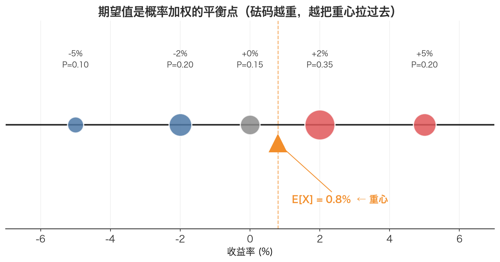

# 期望值 Expected Value

> 期望值不是「最可能发生的结果」，而是「把所有可能结果按概率称重后的重心」——它常常落在一个永远不会真实出现的位置上。

## 1. 探底 · 确认前置知识

读这篇之前，请先确认下面两个概念能脱口而出：

- [随机变量 Random Variable](./ch01-01-random-variable.md)——自测题：「明天某股票的涨跌幅」是随机变量吗？它的取值是离散的还是连续的？为什么说它在结果揭晓前没有确定的数值？
- [概率分布 Probability Distribution](./ch01-02-probability-distribution.md)——自测题：给一张「结果→概率」的表，能说出这张表必须满足哪两个条件吗？（提示：每个概率非负、所有概率之和为 1）

如果上面任何一题卡住了，先回去补这两篇，再回来。期望值本质上就是「把随机变量和它的概率分布揉在一起做一次加权平均」，缺了哪一块都算不动。

## 2. 建立动机 · 为什么需要它？

在写一个策略，回测显示它**胜率高达 70%**，看起来很诱人，于是准备上实盘。

但上线一个月，账户却在缓慢失血。复盘才发现：这个策略赢的时候平均只赚 0.3%，输的时候平均亏 1.2%。胜率虽高，但「赢得少、输得多」，长期下来必然亏钱。

**只看胜率（最可能的结果）会害死人。** 真正需要的是一个把「发生概率」和「发生时的盈亏」一起考虑进去的单一数字——这就是期望值。它回答的问题是：

> 如果这个策略重复执行无数次，平均每次能赚（或亏）多少？

没有期望值，就会被「70% 胜率」这种局部漂亮的指标骗到；有了它，一眼就能算出这个策略的期望收益是负的，根本不该上线。本文配套代码的演示 1 做的正是这件事——把一张收益率分布表压缩成一个期望收益率数字。

## 3. 建立直觉 · 它「感觉上」是什么？

想象一根木尺，上面在不同位置挂了重量不等的砝码。砝码的**位置**代表随机变量可能的取值，砝码的**重量**代表对应的概率。

期望值，就是这根尺子的**平衡点（重心）**——一根手指顶在这个位置，尺子能水平不倒。

- 砝码越重（概率越大）的位置，越能把重心往自己这边拉。
- 重心不一定落在某个砂码上。比如一边挂 +5%、另一边挂 -5%，但 +5% 那端更重，重心会落在 +1% 左右——而 +1% 这个值可能根本不在结果列表里。

这正是关键直觉：**期望值是「概率加权的平均位置」，它本身常常是一个不可能真实发生的值。** 抛硬币赢 1 元、输 1 元，期望是 0 元，但每次要么 +1 要么 -1，永远拿不到 0。



*图：把每个取值看成挂在数轴上的砝码，砝码大小 = 概率。期望值 E[X]=+0.8% 是这根尺子的平衡点（三角支点）——注意它并不落在 +5%、+2%、0%、−2%、−5% 任何一档上，正是「重心可以落在没有砝码的位置」。*

## 4. 给出定义 · 它精确是什么？

对一个**离散随机变量** X，它的取值为 $x_1, x_2, \dots, x_n$，对应概率为 $P(x_1), P(x_2), \dots, P(x_n)$，则期望值定义为：

$$\begin{aligned}
\mathbb{E}[X] &= \sum x_i \cdot P(x_i) \\
     &= x_1 \cdot P(x_1) + x_2 \cdot P(x_2) + \dots + x_n \cdot P(x_n)
\end{aligned}$$

逐个符号拆开：

- $\mathbb{E}[X]$：X 的期望值（Expectation）。也常记作 $\mu$（读作 miu）。单位和 X 本身一样——如果 X 是收益率，$\mathbb{E}[X]$ 就是一个收益率（比如 0.8%）。
- $\sum$：求和号，把后面所有项加起来。
- $x_i$：第 i 个可能的取值。
- $P(x_i)$：取到 $x_i$ 的概率，是一个 0 到 1 之间的数。
- **n**：可能结果的总数。

约束：所有概率之和必须为 1，即 $\sum P(x_i) = 1$。本文配套代码 `expected_value()` 函数里就写死了这个检查：

```python
if abs(sum(probs) - 1.0) > 1e-9:
    raise ValueError(f"概率之和必须为1，当前为 {sum(probs):.6f}")
```

一个特例值得记住：如果 n 个结果**等概率**（每个都是 $1/n$），期望值就退化成普通的算术平均 $(x_1+x_2+\dots+x_n)/n$。这就是后面 [样本均值 Sample Mean](./ch01-06-sample-mean.md)和期望值的桥梁——用历史数据估计期望时，我们默认每个历史样本「等概率」。

## 5. 例题演算 · 手把手算一遍

用本文里的真实分布表。某股票明日收益率的分布如下：

| 结果 | 概率 P | 收益率 x |
|------|--------|----------|
| 大涨 | 0.20 | +5%（0.05） |
| 小涨 | 0.35 | +2%（0.02） |
| 平盘 | 0.15 | 0%（0.00） |
| 小跌 | 0.20 | -2%（-0.02） |
| 大跌 | 0.10 | -5%（-0.05） |
| **合计** | **1.00** | |

第一步，先确认概率之和：$0.20 + 0.35 + 0.15 + 0.20 + 0.10 = 1.00$ ✓

第二步，逐项算 $x_i \cdot P(x_i)$：

$$\begin{aligned}
0.05  \times 0.20 &=  0.0100 \\
0.02  \times 0.35 &=  0.0070 \\
0.00  \times 0.15 &=  0.0000 \\
-0.02 \times 0.20 &= -0.0040 \\
-0.05 \times 0.10 &= -0.0050
\end{aligned}$$

第三步，全部相加：

$$\begin{aligned}
\mathbb{E}[X] &= 0.0100 + 0.0070 + 0.0000 - 0.0040 - 0.0050 \\
     &= 0.0080
\end{aligned}$$

**结论：期望收益率 $\mathbb{E}[X] = 0.008 = 0.8\%$。**

注意：0.8% 这个值**不在**结果列表里（列表里只有 ±5%、±2%、0%）。这正是第 3 节说的「重心落在没有砝码的位置」。用本文配套代码验证一行就够：

```python
outcomes = [0.05,  0.02,  0.00, -0.02, -0.05]
probs    = [0.20,  0.35,  0.15,  0.20,  0.10]
print(expected_value(outcomes, probs))   # 0.008
```

## 6. 你来做 · 即时练习

**练习 1（送分）** 抛一枚均匀硬币，正面赢 3 元，反面输 1 元。求一次抛掷的期望收益。

**练习 2（贴近交易）** 某策略每天只有两种结果：以 55% 的概率赚 1.2%，以 45% 的概率亏 0.8%。求这个策略的**日期望收益率**。

**练习 3（陷阱题）** 策略 A：90% 概率赚 1%，10% 概率亏 10%。策略 B：50% 概率赚 3%，50% 概率亏 1%。哪个策略的期望收益率更高？光看胜率你会选哪个，算完期望又会选哪个？

答案见文末折叠区。

## 7. 深化 · 边界与反常识

- **期望值 ≠ 最可能的结果。** 这是最常见的误解（见本文「关键术语」表）。最可能的结果是概率最大的那个 $x_i$（众数）；期望值是加权重心。两者往往不同，期望值甚至可能不在取值集合里。
- **期望值是「无限次重复」的平均，不是「下一次」的预测。** $\mathbb{E}[X]=0.8\%$ 不代表明天一定涨 0.8%，明天只会是 ±5%、±2%、0% 中的某一个。它描述的是长期统计倾向，单次交易完全可能与期望相反。
- **概率必须真实、可估。** 上面那张分布表里的概率是「假设」出来的。真实交易中拿不到上帝视角的概率，只能用历史频率去**估计**——这就引出了 [样本均值 Sample Mean](./ch01-06-sample-mean.md)（用样本均值估计期望）以及估计带来的误差。垃圾概率进，垃圾期望出。
- **期望值只描述「中心」，不描述「风险」。** 两个策略可以期望相同但风险天差地别。期望刻画平均赚多少，[方差 Variance](./ch01-04-variance.md)/[标准差 Standard Deviation](./ch01-05-standard-deviation.md)才刻画结果有多分散、会不会爆仓。光看期望选策略是不够的，永远要配着波动率一起看。
- **连续随机变量的期望要用积分**，公式变成 $\mathbb{E}[X] = \int x \cdot f(x)\, dx$（f 是概率密度）。本文只处理离散情形，但直觉完全一样：还是「按概率称重的重心」，只是把求和换成积分。

## 8. 联系 · 它在数学地图里的位置

**上游依赖：**
- [随机变量 Random Variable](./ch01-01-random-variable.md)——期望值是「对随机变量做的运算」，没有随机变量就无从谈起。
- [概率分布 Probability Distribution](./ch01-02-probability-distribution.md)——期望值的每一项都需要一个概率作为权重，权重全部来自分布。

**下游用途：**
- [方差 Variance](./ch01-04-variance.md)——方差本身就定义成「偏差平方的期望」：$\operatorname{Var}[X] = \mathbb{E}[(X-\mu)^2]$，它把期望套了一层。
- [标准差 Standard Deviation](./ch01-05-standard-deviation.md)——方差开根号，是金融里的波动率。
- [样本均值 Sample Mean](./ch01-06-sample-mean.md)——用有限历史数据估计期望值的实用工具；等概率情形下期望值就退化成样本均值。
- [简单收益率 Simple Return](./ch01-08-simple-return.md)、[对数收益率 Log Return](./ch01-09-log-return.md)——我们最终求的「平均收益率」就是对收益率这个随机变量取期望；[年化 Annualization](./ch01-12-annualization.md)则是把日期望乘以 252。

一句话定位：**期望值是描述性统计的第一块基石，方差、标准差、年化收益全都建在它之上。**

## 9. 应用 · 量化与算法交易在哪里用它？

期望值是量化里最高频的工具，没有之一：

1. **策略筛选（最直接的用途）。** 任何一个策略的核心问题就是「期望收益是否为正」。第 2、6 节的例子说明：胜率高不等于赚钱，必须算 E[X] = 胜率×平均盈利 + 败率×平均亏损。这个数为负的策略，无论胜率多漂亮都该枪毙。

2. **估计真实市场的平均收益率。** 本文配套代码的做法是：下载沪深300前复权（qfq）日线，算出每日对数收益率序列，然后把整段历史**当成一个等概率离散分布**喂给 `expected_value()`：

   ```python
   # 核心思路：历史样本 = 等概率离散分布
   lr_list  = [log_return(price_list[i-1], price_list[i])
               for i in range(1, len(price_list))]
   n        = len(lr_list)
   eq_probs = [1.0 / n] * n                       # 每个交易日等权重
   manual_mean = expected_value(lr_list, eq_probs)  # 即日均对数收益率
   ```

   这里每个历史日的概率都是 1/n，于是期望值精确退化成样本均值，和 numpy 的 `log_rets.mean()` 结果完全一致（本文配套代码里两者差异打印为约 0）。

3. **年化收益。** 算出日期望后，因为对数收益可加，直接乘 252 就得到 [年化 Annualization](./ch01-12-annualization.md)收益率：`annualise_return(manual_mean) = manual_mean * 252`。这是把「单次期望」放大到「一年期望」。

4. **风控与仓位管理。** 凯利公式、夏普比率的分子都建立在期望收益之上；风控里算「持仓的期望损失」也是同一套加权平均。

注意本文配套代码在算收益率时强调「信号需 shift(1) 延迟一天执行」——这是回测铁律：用 t 日的信息算出的信号，只能在 t+1 日开盘后执行，绝不能用当天还没收盘的价格去交易（那是未来函数），否则算出的期望收益是骗人的。

## 10. 复盘 · 用输出倒逼输入

能清楚回答下面 3 个问题，就说明你真的掌握了期望值：

1. 为什么「期望收益率 0.8%」这个值可能根本不会在任何一天真实发生？这和「重心」的类比怎么对应？
2. 一个胜率 90% 的策略，期望收益却可能是负的。请用一个具体数字例子说明，并写出 E[X] 的算式。
3. 在本文配套代码里，把一年的历史日收益率交给 `expected_value()` 时，每个交易日的「概率」取多少？为什么这样算出来的期望值就等于样本均值？

**费曼式复述任务：** 用一句不含任何公式符号的大白话，向一个完全不懂数学的朋友解释「期望值是什么」，并举一个赌局或交易的例子说明「为什么不能只看胜率」。

---

<details>
<summary>第 6 节练习答案</summary>

**练习 1：** $E = 3 \times 0.5 + (-1) \times 0.5 = 1.5 - 0.5 = +1$（元）。期望为正，长期玩这个游戏是赚的。

**练习 2：** $E = 0.012 \times 0.55 + (-0.008) \times 0.45 = 0.0066 - 0.0036 = 0.003 = 0.3\%$。胜率 55% 看起来一般，但因为赢得多输得少，日期望为正。

**练习 3：**
- 策略 A：$E = 0.01 \times 0.90 + (-0.10) \times 0.10 = 0.009 - 0.010 = -0.001 = -0.1\%$（期望为负！）
- 策略 B：$E = 0.03 \times 0.50 + (-0.01) \times 0.50 = 0.015 - 0.005 = +0.010 = +1.0\%$

光看胜率会选 A（90% vs 50%），算完期望必须选 B。这就是第 2 节那个「高胜率亏钱」陷阱的数值版。

</details>