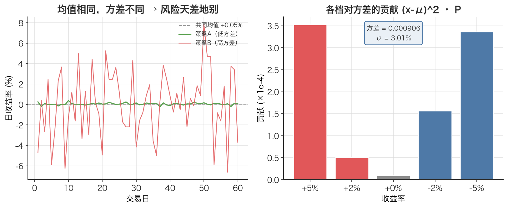

# 方差 Variance

> 期望回答「平均会赚多少」，方差回答「这个平均有多不靠谱」——它是把「偏离均值」这件事量化成一个数。

## 1. 探底 · 确认前置知识

读这篇前，请先确认能答出下面这些。答不出就先回去补。

- [期望值 Expected Value](./ch01-03-expected-value.md)：离散随机变量的期望怎么算？
  - 自测：结果 `[+5%, -5%]`，概率 `[0.5, 0.5]`，期望是多少？（应为 0）
- [随机变量 Random Variable](./ch01-01-random-variable.md)：为什么「明天的收益率」是一个随机变量，而不是一个固定数字？
  - 自测：用一句话说清「随机变量」和「它的某一次取值」的区别。
- 基本运算：需要会算平方 $x^2$、求和 $\sum$、开平方 $\sqrt{\ }$。
  - 自测：$(0.05 - 0.008)^2 = ?$（约 0.001764）

方差本质上就是「对 $(X - \mu)^2$ 求一次期望」，所以期望值是硬前置。

## 2. 建立动机 · 为什么需要它？

假设在挑两个策略，回测下来两者的**日均收益率都是 0.05%**（期望相同）。光看期望，它们一样好。

但策略 A 每天稳稳地 +0.04% ~ +0.06% 之间小幅波动；策略 B 则今天 +8%、明天 −7.9%，靠剧烈震荡凑出同样的平均。

如果只用期望值评估，会得出「两者等价」的错误结论，然后可能上了杠杆去做策略 B。结果某天它先来一个 −20%，账户直接爆仓——根本撑不到「平均」兌现的那一天。

**缺了方差，就只盯着收益、对风险完全瞎了。** 量化里有句话：收益是骗人的，风险是真的。方差（及其平方根标准差）就是把「风险」变成可计算、可比较、可年化的那个数。

## 3. 建立直觉 · 它「感觉上」是什么？

想象一个打靶的靶盘，靶心就是均值 $\mu$。

- 每一发子弹是随机变量的一次取值 $x_i$。
- 「这一发离靶心多远」就是偏差 $x_i - \mu$。
- 把每发的偏差**平方**（这样左偏右偏都算正、且离得越远惩罚越重），再按它出现的概率**加权平均**，得到的就是方差。

为什么要平方而不是直接取绝对值？两个原因：一是平方处处可导，数学上好处理；二是平方放大了大偏离的权重——而在交易里，正是那几次「大偏离」会要命，理应被重点计入。

直觉一句话：**方差 = 平均意义下，离均值多远的平方。** 数越大，结果越「散」，越不可预测，风险越高。



*图：左边两个策略日均收益完全相同，但策略 A 稳、策略 B 剧烈震荡——只看均值会以为它们等价，方差才暴露风险差异；右边是本文分布中每一档对方差的贡献 (x−μ)²·P，大偏离被平方放大，贡献最大。*

## 4. 给出定义 · 它精确是什么？

对离散随机变量 $X$，记其期望为 $\mu = \mathbb{E}[X]$，方差定义为：

$$\operatorname{Var}[X] = \mathbb{E}[(X - \mu)^2] = \sum (x_i - \mu)^2 \cdot P(x_i)$$

逐个符号拆解：

- $X$：随机变量（例如某股票明日收益率）。
- $x_i$：X 的第 i 个可能取值。
- $P(x_i)$：取值 $x_i$ 出现的概率，所有 $P(x_i)$ 之和为 1。
- $\mu$（读 mu）：X 的期望值，$\mu = \sum x_i \cdot P(x_i)$，单位与 X 相同。
- $(x_i - \mu)^2$：偏差的平方，单位是 X 单位的**平方**。
- $\operatorname{Var}[X]$：方差，**单位是 X 单位的平方**（这点极其重要，见第 7 节）。

由于单位被平方了，方差本身不直观（收益率的方差单位是「收益率$^2$」）。所以实务里更常报告它的平方根——[标准差 Standard Deviation](./ch01-05-standard-deviation.md)$\sigma$：

$$\sigma = \sqrt{\operatorname{Var}[X]}$$

$\sigma$ 与 X 同量纲，在金融里就叫**波动率（Volatility）**，是风险的核心度量。

> 注：这里讲的是**理论方差**（已知概率分布，用真实均值 $\mu$）。当只有一组样本、不知道真实 $\mu$ 时，要用样本均值估计，并改用 $n-1$ 做分母——那是 [样本均值 Sample Mean](./ch01-06-sample-mean.md) 和 [贝塞尔校正（n-1） Bessel's Correction](./ch01-07-bessels-correction.md) 的话题，第 7 节会点到。

## 5. 例题演算 · 手把手算一遍

用本文里那张明日收益率分布表（与本文配套代码的「演示 1」完全一致）：

| 结果 | 概率 P | 收益率 x |
|------|--------|----------|
| 大涨 | 0.20 | +0.05 |
| 小涨 | 0.35 | +0.02 |
| 平盘 | 0.15 | 0.00 |
| 小跌 | 0.20 | -0.02 |
| 大跌 | 0.10 | -0.05 |

**第 1 步：算期望 $\mu$。**

$$\begin{aligned}
\mu &= 0.05\cdot 0.20 + 0.02\cdot 0.35 + 0.00\cdot 0.15 + (-0.02)\cdot 0.20 + (-0.05)\cdot 0.10 \\
    &= 0.010 + 0.007 + 0.000 - 0.004 - 0.005 \\
    &= 0.008
\end{aligned}$$

（即 +0.8%）

**第 2 步：算每个结果的偏差平方 $(x - \mu)^2$。**

$$\begin{aligned}
(0.05 - 0.008)^2 &= (0.042)^2 = 0.001764 \\
(0.02 - 0.008)^2 &= (0.012)^2 = 0.000144 \\
(0.00 - 0.008)^2 &= (-0.008)^2 = 0.000064 \\
(-0.02 - 0.008)^2 &= (-0.028)^2 = 0.000784 \\
(-0.05 - 0.008)^2 &= (-0.058)^2 = 0.003364
\end{aligned}$$

**第 3 步：用概率加权求和，得到方差。**

$$\begin{aligned}
\operatorname{Var} &= 0.001764\cdot 0.20 + 0.000144\cdot 0.35 + 0.000064\cdot 0.15 \\
    &\quad + 0.000784\cdot 0.20 + 0.003364\cdot 0.10 \\
    &= 0.0003528 + 0.0000504 + 0.0000096 + 0.0001568 + 0.0003364 \\
    &= 0.000906
\end{aligned}$$

**第 4 步：开平方得标准差（波动率）。**

$$\sigma = \sqrt{0.000906} \approx 0.0301$$

（即约 3.01%）

解读：明日期望收益 +0.8%，但波动率约 3%。也就是说，「平均 +0.8%」附近其实抖得很厉害，单日跑出 ±3% 量级的偏离很正常。用本文配套代码跑这段会打印出 `方差 0.000906、标准差 3.01%`，与手算一致。

## 6. 你来做 · 即时练习

1. 抛一枚均匀硬币，正面记 $+1$、反面记 $-1$，概率各 0.5。求 $\mathbb{E}[X]$ 与 $\operatorname{Var}[X]$。
2. 一个策略每天只有两种结果：以概率 0.55 盈利 +1.2%，以概率 0.45 亏损 −0.8%。求日期望收益率与日方差、日波动率。
3. 把第 2 题的日波动率年化（用本文的时间平方根法则：$\sigma_{\text{year}} = \sigma_{\text{day}} \times \sqrt{252}$）。

答案见文末折叠区。

## 7. 深化 · 边界与反常识

- **方差不是标准差，别混用。** 方差单位是「X 的平方」，标准差才与 X 同量纲。报告风险时几乎总是报标准差（波动率）。本文关键术语表专门强调了这条常见误解。
- **理论方差用 $n$，样本方差用 $n-1$。** 第 4 节是已知概率分布的理论方差（分母相当于权重和 1）。但回测时拿到的是一组历史样本、并用样本均值代替真实 $\mu$，这会系统性低估方差，必须用 $n-1$ 校正——见 [贝塞尔校正（n-1） Bessel's Correction](./ch01-07-bessels-correction.md)。`numpy` 里就是 `np.var(x, ddof=1)` 对应 `pandas` 的 `.std()`（默认 ddof=1）。本文配套代码末尾「两者差异（波动率）」那条极小的非零值，正是手动实现（等概率、相当于 ddof=0）与 `.std()`（ddof=1）的差异来源。
- **方差对极端值极度敏感。** 因为有平方项，一两个暴涨暴跌日会把方差顶得很高。这是优点（如实反映尾部风险），也是陷阱（小样本里一个异常值就能扭曲估计）。
- **方差只衡量「散」，不衡量「方向」。** 一个天天大涨的资产和一个天天暴跌的资产，可以有相同方差。所以方差度量的是**不确定性**，不是好坏；判断好坏要配合期望一起看。
- **常见误区：方差大 = 不好。** 不一定。期权买方、趋势策略恰恰靠高波动赚钱。方差是中性的风险刻画，是否「不好」取决于策略和承受能力。

## 8. 联系 · 它在数学地图里的位置

**上游依赖：**
- [期望值 Expected Value](./ch01-03-expected-value.md)——方差就是对 $(X-\mu)^2$ 求期望，离了它无从谈起。
- [随机变量 Random Variable](./ch01-01-random-variable.md)、[概率分布 Probability Distribution](./ch01-02-probability-distribution.md)——方差是分布的一个数字特征。

**下游用途：**
- [标准差 Standard Deviation](./ch01-05-standard-deviation.md)——方差开平方，即金融里的波动率。
- [样本均值 Sample Mean](./ch01-06-sample-mean.md)、[贝塞尔校正（n-1） Bessel's Correction](./ch01-07-bessels-correction.md)——从样本估计方差时的两块拼图。
- [时间平方根法则 Square-Root-of-Time Rule](./ch01-13-sqrt-time-rule.md)、[年化 Annualization](./ch01-12-annualization.md)——年化波动率正是建立在「$n$ 天总收益的方差 $= n \times$ 日方差」这一方差可加性之上（独立同分布假设下）。

## 9. 应用 · 量化与算法交易在哪里用它？

方差/波动率几乎渗透到量化的每个环节：

- **风控与仓位管理**：波动率目标（vol targeting）策略把仓位设为 `目标波动率 / 资产波动率`，波动大就自动减仓。爆仓的根源往往是低估了方差。
- **回测评估**：夏普比率 = 年化超额收益 / 年化波动率，分母就是方差开平方再年化。两个策略期望相同时，方差小的夏普更高（见第 2 节的痛点）。
- **波动率信号**：滚动 20 日年化波动率本身可作为择时/风险开关——高波动期降杠杆。

本文配套代码里方差就是从零实现的核心函数之一：

```python
def variance(values: list, probs: list) -> float:
    """方差：Var[X] = E[(X - μ)²] = Σ (x_i - μ)² * P(x_i)"""
    mu = expected_value(values, probs)
    return sum((x - mu) ** 2 * p for x, p in zip(values, probs))
```

在真实数据部分，它先把沪深300日对数收益率序列当成「等概率离散分布」，用上面的 `variance / std_dev` 手算波动率，再和 `numpy` 的 `log_rets.std() * np.sqrt(252)` 对比，验证两者一致：

```python
# 注意：收益率用 close 与 close.shift(1) 相除得到，shift(1) 保证不引入未来数据
log_rets = np.log(close / close.shift(1)).dropna()
ann_vol  = log_rets.std() * np.sqrt(252)   # 年化波动率 = 日波动率 × √252
```

数据用 `index_zh_a_hist(..., adjust="qfq")` 前复权获取，避免除权跳变污染收益率与方差估计。年化那一步（√252）背后正是「方差随时间线性累加」的原理，详见 [时间平方根法则 Square-Root-of-Time Rule](./ch01-13-sqrt-time-rule.md)。

## 10. 复盘 · 用输出倒逼输入

能干净利落答出下面三问，就算掌握了：

1. 为什么方差要对偏差**平方**，而不是直接取绝对值或直接相加？（提示：相加会抵消为 0；平方放大大偏离。）
2. 方差和标准差的**单位**分别是什么？为什么实务里更常报标准差？
3. 同样是「散度」，理论方差除以 $n$、样本方差除以 $n-1$，差别为什么会出现？

**费曼式复述任务**：用一句不含公式的大白话，向一个只会编程、不懂统计的朋友解释「方差衡量的是什么」，并举一个交易里的例子说明「为什么期望一样、方差不同的两个策略，风险天差地别」。

---

<details>
<summary>第 6 节练习答案</summary>

**第 1 题**
$\mu = (+1)(0.5) + (-1)(0.5) = 0$。
$\operatorname{Var} = (1-0)^2\cdot 0.5 + (-1-0)^2\cdot 0.5 = 0.5 + 0.5 = 1$。标准差 $\sigma = 1$。

**第 2 题**
$\mu = 0.012\cdot 0.55 + (-0.008)\cdot 0.45 = 0.0066 - 0.0036 = 0.0030$（日均 +0.30%）。
偏差平方：
$(0.012 - 0.003)^2 = 0.009^2 = 0.000081$；
$(-0.008 - 0.003)^2 = (-0.011)^2 = 0.000121$。
$\operatorname{Var} = 0.000081\cdot 0.55 + 0.000121\cdot 0.45 = 0.00004455 + 0.00005445 = 0.000099$。
日波动率 $\sigma = \sqrt{0.000099} \approx 0.00995$（约 0.995%）。

**第 3 题**
$\sigma_{\text{year}} = 0.00995 \times \sqrt{252} \approx 0.00995 \times 15.87 \approx 0.158$，即年化波动率约 **15.8%**。
（对照：日均收益年化 $0.0030 \times 252 \approx 75.6\%$，但别被这个数迷惑——它假设胜率与盈亏比长期不变，现实远没这么稳定。）

</details>
