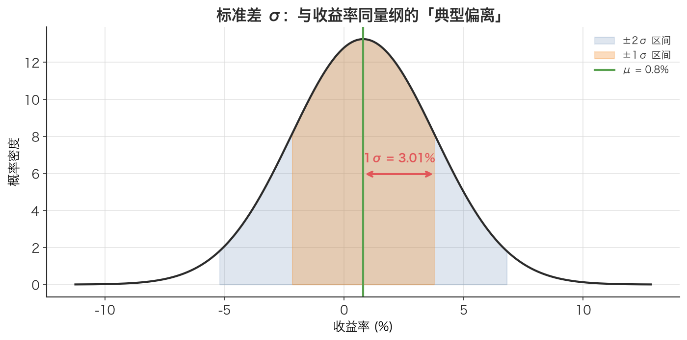

# 标准差 Standard Deviation

> 方差把单位平方了，没法直接看；开个平方根，就得到一个和数据本身同量纲、能直接读懂的「典型偏离量」——这就是标准差，量化里它有个更响亮的名字：波动率。

## 1. 探底 · 确认前置知识

读这篇前，请确认能答出下面这几道自测题。答不上来就先回去补：

- [方差 Variance](./ch01-04-variance.md)：方差衡量的是什么？它的单位和原始数据的单位是什么关系？
  - 自测：若收益率以「百分比」为单位，方差的单位是什么？（答：百分比的平方，所以读起来很别扭）
- [期望值 Expected Value](./ch01-03-expected-value.md)：方差的定义 $\operatorname{Var}[X] = \mathbb{E}[(X-\mu)^2]$ 里，外层的 $\mathbb{E}[\cdot]$ 是什么意思？
  - 自测：把每个 $(x-\mu)^2$ 按概率加权求和，得到的是什么？
- [样本均值 Sample Mean](./ch01-06-sample-mean.md)：当只有一串历史数据、没有理论概率时，$\mu$ 用什么代替？
  - 自测：5 个数 $[1,2,3,4,5]$ 的样本均值是多少？（答：3）

标准差几乎就是方差的「最后一步」，所以方差这关必须过。

## 2. 建立动机 · 为什么需要它？

假设回测了一个 A 股日内策略，得到日均对数收益率 $\mu = 0.0008$（0.08%），同时算出方差 $\operatorname{Var} = 0.000225$。

现在要回答一个最朴素的问题：**「这个策略每天大概上下波动多大？」**

但方差是 `0.000225`，单位是「收益率的平方」。0.000225 个「收益率平方」到底是多大波动？没人能直觉化地读懂这个数。没法跟基金经理说「我们策略的风险是 0.000225 收益率平方」——他会一脸茫然。

更糟的是，方差没法和均值放在一起比较：均值 `0.0008` 单位是「收益率」，方差单位是「收益率²」，二者量纲不同，强行相除或相减都是错的。

**缺了标准差会踩的坑**：无法构造像「夏普比率 = 年化收益 / 年化波动率」这种风险调整后的指标，因为分子分母量纲对不上；也没法说「日波动率约 1.5%」这种交易员一听就懂的话。标准差就是把方差「翻译」回人话的那一步。

## 3. 建立直觉 · 它「感觉上」是什么？

想象在打靶。**方差**回答「弹孔到靶心距离的平方，平均有多大」——一个被平方放大、单位古怪的数。**标准差**则是把它开方还原，回答「弹孔通常偏离靶心多少厘米」——一个能直接拿尺子量、能直接想象的距离。

换句话说：

- 标准差 ≈ 数据点「典型地」偏离均值多远。
- 它和原始数据**同量纲**：数据是收益率，标准差就是收益率；数据是厘米，标准差就是厘米。
- 它越大 → 数据越散、越不可预测 → 在金融里就是风险越高。

一句话：**方差是「平均的平方偏离」，标准差是把它开方后得到的「典型偏离」。** 二者描述同一件事，但标准差能直接读、能直接比。



*图：标准差 σ 与收益率同量纲（这里约 3.01%），可以和均值 μ=0.8% 直接摆在一起读，而方差（单位是收益率的平方）做不到。阴影是 ±1σ、±2σ 区间，σ 就是「典型偏离均值多远」。*

## 4. 给出定义 · 它精确是什么？

标准差是方差的算术平方根，记作 $\sigma$（小写希腊字母 sigma）。

**对已知概率分布的随机变量 X（总体标准差）：**

$$\sigma = \sqrt{\operatorname{Var}[X]} = \sqrt{\sum (x_i - \mu)^2 \cdot P(x_i)}$$

**对一串样本数据 $x_1,\dots,x_n$（样本标准差）：**

$$\sigma = \sqrt{\frac{1}{n} \sum (x_i - \bar{x})^2}$$

（总体口径，除以 n，ddof=0）

$$s = \sqrt{\frac{1}{n-1} \sum (x_i - \bar{x})^2}$$

（样本口径，除以 n−1，贝塞尔校正）

逐符号解释：

- $\sigma$（或 $s$）：标准差，单位 = X 的单位（这是它最大的卖点）。
- $\operatorname{Var}[X]$：方差，单位 = X 单位的平方。
- $\mu$：总体均值（理论期望）；$\bar{x}$：样本均值（用数据估计）。
- $x_i$：第 i 个取值；$P(x_i)$：该取值的概率。
- $n$：样本个数；$n-1$：贝塞尔校正后的自由度，详见 [贝塞尔校正（n-1） Bessel's Correction](./ch01-07-bessels-correction.md)。

记住关系链：**标准差 = $\sqrt{\text{Var}}$，方差 = 标准差的平方**。本文在金融语境下把 $\sigma$ 直接称为**波动率（Volatility）**。

## 5. 例题演算 · 手把手算一遍

用本文里那只「明日收益率」离散随机变量，亲手算出标准差。分布如下：

| 结果 | 概率 P | 收益率 x |
|------|--------|----------|
| 大涨 | 0.20 | +0.05 |
| 小涨 | 0.35 | +0.02 |
| 平盘 | 0.15 | 0.00 |
| 小跌 | 0.20 | -0.02 |
| 大跌 | 0.10 | -0.05 |

**第 1 步：算期望 $\mu$（[期望值 Expected Value](./ch01-03-expected-value.md)）**

$$\begin{aligned}
\mu &= 0.05 \cdot 0.20 + 0.02 \cdot 0.35 + 0.00 \cdot 0.15 + (-0.02) \cdot 0.20 + (-0.05) \cdot 0.10 \\
  &= 0.010 + 0.007 + 0 - 0.004 - 0.005 \\
  &= 0.008
\end{aligned}$$

**第 2 步：算每个 $(x-\mu)^2$**

$$\begin{aligned}
(0.05  - 0.008)^2 &= ( 0.042)^2 = 0.001764 \\
(0.02  - 0.008)^2 &= ( 0.012)^2 = 0.000144 \\
(0.00  - 0.008)^2 &= (-0.008)^2 = 0.000064 \\
(-0.02 - 0.008)^2 &= (-0.028)^2 = 0.000784 \\
(-0.05 - 0.008)^2 &= (-0.058)^2 = 0.003364
\end{aligned}$$

**第 3 步：按概率加权求和，得到方差（[方差 Variance](./ch01-04-variance.md)）**

$$\begin{aligned}
\operatorname{Var} &= 0.001764 \cdot 0.20 + 0.000144 \cdot 0.35 + 0.000064 \cdot 0.15 + 0.000784 \cdot 0.20 + 0.003364 \cdot 0.10 \\
    &= 0.0003528 + 0.0000504 + 0.0000096 + 0.0001568 + 0.0003364 \\
    &= 0.000906
\end{aligned}$$

**第 4 步：开平方，得到标准差**

$$\sigma = \sqrt{0.000906} \approx 0.030100 \approx 3.01\%$$

**结论**：这只股票明日收益率的期望是 +0.8%，但标准差（波动率）约 **3.01%**——典型的单日波动远大于期望涨幅，说明不确定性主导。注意 $\sigma$ 的单位就是「收益率」，可以和 $\mu=0.8\%$ 直接放在一起对比，而方差 0.000906 做不到这点。

可用本文配套代码里的函数一键复算：

```python
from main import expected_value, variance, std_dev

outcomes = [0.05, 0.02, 0.00, -0.02, -0.05]
probs    = [0.20, 0.35, 0.15,  0.20,  0.10]

print(std_dev(outcomes, probs))  # ≈ 0.030100
```

## 6. 你来做 · 即时练习

1. 数据 $[2, 4, 4, 4, 5, 5, 7, 9]$，均值是 5。请算它的**总体**标准差（除以 n）。
2. 某策略日方差为 $0.000256$。它的日标准差（日波动率）是多少？换算成百分比是多少？
3. 同上策略，用本文的平方根法则把日波动率年化（$\times \sqrt{252}$）。年化波动率约是多少百分比？（提示：$\sqrt{252} \approx 15.87$，可参考 [时间平方根法则 Square-Root-of-Time Rule](./ch01-13-sqrt-time-rule.md)）

答案见文末折叠区。

## 7. 深化 · 边界与反常识

- **标准差 ≠ 方差，别混用。** 方差与数据量纲平方，标准差与数据同量纲。年化时也不同：年化均值 $\times 252$，年化波动率 $\times \sqrt{252}$（见 [年化 Annualization](./ch01-12-annualization.md)、[时间平方根法则 Square-Root-of-Time Rule](./ch01-13-sqrt-time-rule.md)），千万别给波动率也乘 252。
- **n 还是 n−1？** 已知整体概率分布时用总体公式（除以 n）；只有一份样本、要估计未知总体时用 n−1（[贝塞尔校正（n-1） Bessel's Correction](./ch01-07-bessels-correction.md)）。本文配套代码的 `std_dev` 用的是除以 n（总体口径），而 numpy 的 `.std()` 默认也是 ddof=0（除以 n），所以二者结果一致；pandas 的 `.std()` 默认是 ddof=1（除以 n−1）——本文配套代码注释里提到的「ddof 差异」就是指这种默认值的不同，样本量大时差异极小。
- **标准差对异常值敏感。** 因为先平方，一个极端的暴涨/暴跌（如涨停板）会被放大，显著推高标准差。重大事件日的波动率会因此「虚高」。
- **它不区分上行与下行风险。** 大涨和大跌对标准差的贡献完全对称，但交易者通常只怕下跌。这也是为什么实务中还会用「下行标准差 / 索提诺比率」来单独度量亏损方向的波动。
- **它假设波动稳定。** 用历史标准差预测未来，隐含「波动率不变」的假设；而真实市场有波动率聚集（大波动后常跟大波动），这是后续课程 GARCH 等模型要解决的问题。

## 8. 联系 · 它在数学地图里的位置

**上游依赖：**

- [方差 Variance](./ch01-04-variance.md)——标准差就是它的平方根，是直接父节点。
- [期望值 Expected Value](./ch01-03-expected-value.md)与 [样本均值 Sample Mean](./ch01-06-sample-mean.md)——方差内部要用到。
- [贝塞尔校正（n-1） Bessel's Correction](./ch01-07-bessels-correction.md)——决定除以 n 还是 n−1。

**下游用途：**

- [年化 Annualization](./ch01-12-annualization.md)与 [时间平方根法则 Square-Root-of-Time Rule](./ch01-13-sqrt-time-rule.md)——把日标准差缩放到年化波动率。
- 风险调整收益（如夏普比率）以年化波动率为分母。
- [对数收益率 Log Return](./ch01-09-log-return.md)序列的标准差，是量化里最常用的波动率估计。

一句话定位：标准差是「方差 → 可读的风险度量 → 年化波动率 → 风险指标」这条链上承上启下的关键一环。

## 9. 应用 · 量化与算法交易在哪里用它？

标准差在量化里几乎无处不在，核心是**波动率**这个化身：

- **风控与仓位管理**：波动率目标法（vol targeting）按 `仓位 ∝ 目标波动率 / 当前波动率` 动态调仓——波动率高时减仓、低时加仓，让组合风险保持平稳。这里的「当前波动率」就是收益率序列的标准差。
- **回测评估**：夏普比率 = 年化超额收益 / 年化波动率。本文配套代码正是这样算年化波动率的：

```python
# 摘自本文配套代码：对数收益率 → 年化波动率
log_rets = np.log(close / close.shift(1)).dropna()   # shift(1) 避免未来函数
ann_vol  = log_rets.std() * np.sqrt(252)             # 标准差 ×√252 年化
print(f"[numpy] 年化波动率：{ann_vol*100:.2f}%")
```

注意数据用沪深300指数的**前复权（qfq）**收盘价，且收益率构造严格用 `shift(1)`，不引入未来数据。

- **滚动波动率与异常监测**：用 `close.pct_change().rolling(20).std()` 计算滚动 20 日波动率，可识别市场进入高波动阶段（对应本文练习 3，找波动率最高的交易日）。
- **布林带等指标**：中轨 ± k×标准差构成上下轨，直接以标准差刻画价格带宽。

本文配套代码还用 `std_dev(values, probs)` 把历史样本当作等概率离散分布来手算标准差，并与 numpy 结果对比，验证「手动实现」与「库实现」完全一致——这正是理解 $\sigma$ 定义的好方式。

## 10. 复盘 · 用输出倒逼输入

能干净利落地回答下面三问，就算掌握了：

1. 为什么实务中报告风险用标准差而不用方差？（关键词：同量纲、可读、可与均值比较）
2. 给定日方差，写出年化波动率的完整公式，并说明为什么是 ×√252 而不是 ×252。
3. 本文配套代码里的 `std_dev` 除以 n，pandas 的 `.std()` 默认除以 n−1，这个差别叫什么？什么时候该用哪个？

**费曼式复述任务**：用一句不超过 30 字的大白话，向一个只懂高中数学的朋友解释「标准差和方差到底差在哪、为什么交易员更爱用标准差」。

---

<details>
<summary>第 6 节练习答案</summary>

1. 各 $(x-5)^2$：9,1,1,1,0,0,4,16，和为 32；除以 $n=8$ 得方差 4；$\sigma = \sqrt{4} = $ **2**。
2. $\sigma = \sqrt{0.000256} = $ **0.016 = 1.6%**。
3. 年化波动率 $= 0.016 \times \sqrt{252} \approx 0.016 \times 15.87 \approx$ **0.254 = 25.4%**。

</details>