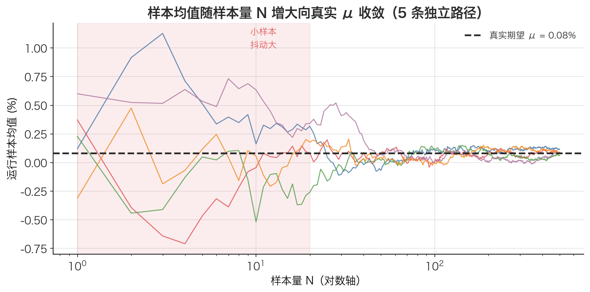

# 样本均值 Sample Mean

> 拿不到上帝视角的「真实期望」时，只能用手里这一串历史数据求平均——这个平均，就是对真实期望的最佳猜测。

## 1. 探底 · 确认前置知识

读这篇前，请确认真的懂下面这个概念：

- [期望值 Expected Value](./ch01-03-expected-value.md)：理论上的概率加权平均 $\mathbb{E}[X] = \sum x_i \cdot P(x_i)$。
  - 自测题：某股票明天涨 5% 概率 0.2、涨 2% 概率 0.35、平盘概率 0.15、跌 2% 概率 0.2、跌 5% 概率 0.1，它的期望收益率是多少？（提示：本文算过，答案 0.8%）

如果答不上来，先回去看 [期望值 Expected Value](./ch01-03-expected-value.md)，因为样本均值就是「在不知道那些概率时，用数据反推期望」的工具。

## 2. 建立动机 · 为什么需要它？

期望值 `E[X]` 有个致命的现实问题：**它要求提前知道每种结果的概率**。

可在真实交易里，没人会把「沪深300明天涨 1% 的概率是 0.23」这种数字递过来。手里只有一串已经发生的历史日收益率：`+0.4%, -1.2%, +0.8%, ...`。概率分布是隐藏的，看不见。

那怎么估计这只指数「平均一天涨多少」？最自然的做法：**把过去 N 天的收益率加起来除以 N**。这就是样本均值。

踩坑场景：一个新手回测时，想估计某策略的日均收益，结果只用了 5 个交易日的数据，算出日均 +1.5%，兴奋地年化成 +378%，重仓上线后亏到怀疑人生。问题不在公式，而在他把「5 个样本的均值」当成了「真实期望」——样本太少时，样本均值离真实期望可以差得离谱。理解样本均值，首先要理解它**只是个估计，会抖动**。

## 3. 建立直觉 · 它「感觉上」是什么？

想象真实期望 `μ` 是一个藏在墙后、永远看不到的靶心。

每次「采样」（观测 N 个数据点求平均），相当于朝墙后手一镖。镖不会每次都正中靶心——它会落在靶心附近，时左时右。

- 手的样本越多（N 越大），镖越往靶心收拢；
- 样本越少，镖散得越开，单次可能离靶心很远。

样本均值就是「这一镖的落点」。它是对靶心 `μ` 的一次猜测，本身也是个会变的随机量。换数据、换时间窗，均值就变。这跟期望值（固定不变的理论值）有本质区别：**期望是靶心，样本均值是某一镖**。



*图：5 条独立的「运行样本均值」曲线，随样本量 N（对数轴）增大都向真实期望 μ 收敛——这就是大数定律。左侧阴影区（N 很小）里曲线抖动剧烈，正是「只用 5 天数据估日均收益」会严重失真的原因。*

## 4. 给出定义 · 它精确是什么？

给定 N 个观测值 $x_1, x_2, \dots, x_N$（比如 N 个交易日的对数收益率），样本均值记作 $\bar{x}$（读作 "x-bar"）：

$$\bar{x} = \frac{1}{N} \sum_{i=1}^{N} x_i$$

逐个符号拆解：

- $\bar{x}$：样本均值，最终结果。单位与 $x_i$ 相同（收益率是无量纲小数，如 0.008）。
- $x_i$：第 i 个观测值，比如第 i 天的对数收益率。
- $N$：样本数量（观测到的数据点个数）。
- $\sum$：求和符号，把所有 $x_i$ 加起来。

注意它和期望值 $\mathbb{E}[X] = \sum x_i \cdot P(x_i)$ 的关系：当**假设每个观测点等概率**（概率都是 $1/N$）时，期望公式就退化成样本均值——

$$\sum x_i \cdot \tfrac{1}{N} = \tfrac{1}{N} \sum x_i = \bar{x}$$

这正是本文配套代码里的做法：把历史收益率当成一个「等概率离散分布」，用 `expected_value(values, [1/N]*N)` 算出来的，就是样本均值。

## 5. 例题演算 · 手把手算一遍

沿用 docs 里的价格序列，多加一天：四天收盘价 $P = [100, 105, 110, 108]$。我们求这三段**对数收益率**的样本均值。

第一步：算每段对数收益率 $r_i = \ln(P_t / P_{t-1})$。

$$\begin{aligned}
r_1 &= \ln(105/100) = \ln(1.05000) =  0.048790 \\
r_2 &= \ln(110/105) = \ln(1.04762) =  0.046520 \\
r_3 &= \ln(108/110) = \ln(0.98182) = -0.018349
\end{aligned}$$

第二步：求和。

$$\sum r_i = 0.048790 + 0.046520 + (-0.018349) = 0.076961$$

第三步：除以样本数 $N = 3$。

$$\bar{x} = 0.076961 / 3 = 0.025654$$

所以这三天的日均对数收益率约为 **0.02565（即 2.57%/天）**。

验证小技巧：对数收益率可加（见 [对数收益的时间可加性 Time-Additivity of Log Returns](./ch01-10-log-return-additivity.md)），三段之和 $0.076961 = \ln(108/100)$，正是从 100 到 108 的总对数收益。样本均值就是把这个总收益平摊到每一天。

## 6. 你来做 · 即时练习

1. 五个交易日的对数收益率为 $[0.01, -0.02, 0.015, 0.00, -0.005]$，求样本均值 $\bar{x}$。
2. 上一题的样本均值，按本文方法年化（日均 $\times 252$，见 [年化 Annualization](./ch01-12-annualization.md)），年化收益率是多少？
3. 把第 1 题的数据点顺序打乱重排，样本均值会变吗？为什么？

答案见文末折叠区。

## 7. 深化 · 边界与反常识

- **样本均值 ≠ 期望值**。期望 $\mu$ 是固定真值，样本均值 $\bar{x}$ 是估计，会随样本抖动。N 越大，$\bar{x}$ 越接近 $\mu$（大数定律）。别把小样本的均值当真理。
- **对极端值（离群点）敏感**。一个涨停或暴跌就能把均值拽偏。2015 年股灾里某天 -8% 能显著拉低整段历史的日均收益。需要稳健估计时人们会改用中位数。
- **算术均值 vs 几何均值的陷阱**。对**简单收益率**求样本均值，会高估实际复合收益（这正是本文「涨 50% 再跌 50% 平均为 0、实际亏 25%」的故事）。所以量化里通常对**对数收益率**求均值——它可加，均值能正确还原总收益。见 [对数收益率 Log Return](./ch01-09-log-return.md)、[简单收益率 Simple Return](./ch01-08-simple-return.md)。
- **均值不等于「典型值」**。收益率分布往往有肥尾，均值可能落在一个几乎没真实发生过的位置（参见 [期望值 Expected Value](./ch01-03-expected-value.md) 的同类警告）。
- **它只是一阶矩**。均值完全不描述波动。同样日均 0.05% 的两个策略，一个稳如老狗、一个上蹿下跳，要靠 [方差 Variance](./ch01-04-variance.md) / [标准差 Standard Deviation](./ch01-05-standard-deviation.md) 区分。

## 8. 联系 · 它在数学地图里的位置

上游依赖：

- [期望值 Expected Value](./ch01-03-expected-value.md)——样本均值是「等概率假设下的期望」，是它的经验版本。
- [随机变量 Random Variable](./ch01-01-random-variable.md)、[概率分布 Probability Distribution](./ch01-02-probability-distribution.md)——样本均值估计的正是分布的中心。

下游用途：

- [方差 Variance](./ch01-04-variance.md)、[标准差 Standard Deviation](./ch01-05-standard-deviation.md)——计算它们的第一步就是先求出样本均值 $\bar{x}$，再算各点对 $\bar{x}$ 的偏差平方。
- [贝塞尔校正（n-1） Bessel's Correction](./ch01-07-bessels-correction.md)——样本方差为何除以 N-1 而非 N，根源就在于「用了样本均值这个估计值」。
- [年化 Annualization](./ch01-12-annualization.md)、[时间平方根法则 Square-Root-of-Time Rule](./ch01-13-sqrt-time-rule.md)——日均收益率 × 252 就是把样本均值年化。

## 9. 应用 · 量化与算法交易在哪里用它？

样本均值是几乎所有量化指标的「地基」：

- **估计预期收益**：回测里「策略日均收益率」「年化收益率」全是样本均值。本文配套代码中 `log_rets.mean() * 252` 和手动版 `expected_value(lr_list, [1/n]*n)` 算的都是它，再乘 252 年化（见 [年化 Annualization](./ch01-12-annualization.md)）。
- **移动平均（MA）线**：均线就是价格在滚动窗口上的样本均值，是趋势策略的核心信号。
- **滚动统计 / 风控**：docs 练习 3 里的「滚动 20 日波动率」，每一步都先在窗口内求样本均值再算标准差。

务必避免未来函数：用样本均值生成的信号，必须 `shift(1)` 延后一天才能交易。下面是对齐本文写法的安全示例。

```python
import numpy as np
import pandas as pd
import akshare as ak

# 沪深300日线，前复权(qfq)
raw = ak.index_zh_a_hist(symbol="000300", period="daily",
                         start_date="20230101", end_date="20231231",
                         adjust="qfq")
raw = raw.rename(columns={"日期": "date", "收盘": "close"})
raw["date"] = pd.to_datetime(raw["date"])
close = raw.set_index("date").sort_index()["close"]

log_rets = np.log(close / close.shift(1)).dropna()

# 样本均值 = 日均对数收益率（mean 即 (1/N)·Σ）
daily_mean = log_rets.mean()
print(f"日均对数收益率(样本均值): {daily_mean:.6f}")
print(f"年化收益率: {daily_mean * 252 * 100:.2f}%")

# 20日均线作信号：信号必须 shift(1)，绝不用当日均值交易当日
ma20 = close.rolling(20).mean()
signal = (close > ma20).astype(int).shift(1)  # 昨日收盘站上均线 → 今日持有
```

## 10. 复盘 · 用输出倒逼输入

能清晰回答下面三个问题，就说明你掌握了：

1. 样本均值和期望值的公式各是什么？为什么说「等概率假设下，期望退化为样本均值」？
2. 为什么量化里通常对**对数收益率**而不是简单收益率求均值？小样本求均值有什么风险？
3. 在你的回测代码里，样本均值出现在哪些地方？为什么用它生成的信号要 `shift(1)`？

费曼式复述任务：用一句话向完全不懂数学的朋友解释——「我手上只有过去 100 天的涨跌数据，凭什么我敢说这只股票『平均一天涨 0.05%』？」

---

<details>
<summary>第 6 节练习答案</summary>

1. $\sum = 0.01 - 0.02 + 0.015 + 0.00 - 0.005 = 0.00$，$\bar{x} = 0.00 / 5 = 0.000$。这五天平均下来不赚不赔。
2. $0.000 \times 252 = 0.00$，年化 0%。（样本均值为 0，年化后仍是 0。）
3. **不会变**。样本均值只跟「所有值的总和」和「个数」有关，与顺序无关（加法满足交换律）。这也提醒一点：样本均值丢掉了时间顺序信息，它看不出收益是先涨后跌还是先跌后涨。

</details>