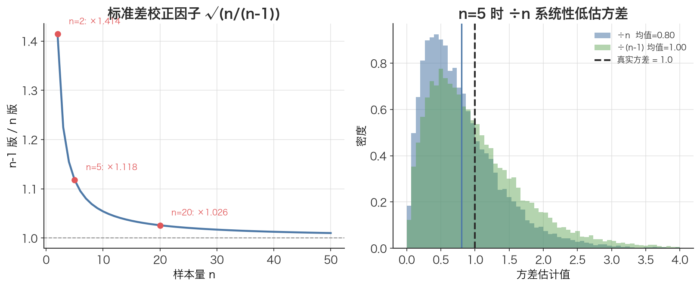

# 贝塞尔校正（n-1） Bessel's Correction

> 用「样本均值」去估计方差时，分母除以 n 会系统性地低估真实方差——把 n 换成 n−1 正好补回这个偏差。

## 1. 探底 · 确认前置知识

读这篇前，请先确认能答出下面两个自测题：

- [方差 Variance](./ch01-04-variance.md)：方差衡量「数据偏离均值的平方的平均值」。**自测**：方差的单位和原始数据是同量纲吗？（答：不是，是平方量纲，所以才需要开方得标准差）
- [样本均值 Sample Mean](./ch01-06-sample-mean.md)：把 n 个观测值加起来除以 n。**自测**：样本均值 $\bar{x}$ 和真实总体均值 $\mu$ 是同一个东西吗？（答：不是，$\bar{x}$ 只是用有限数据对 $\mu$ 的估计，几乎总会有偏差）

抓住一个关键区别：**总体（population）** 的真实均值 $\mu$ 我们通常不知道；**样本（sample）** 里我们只能用算出来的 $\bar{x}$ 代替它。这篇讲的就是这个「代替」带来的代价。

---

## 2. 建立动机 · 为什么需要它？

回到本文配套代码的最后一段。它做了一件事：先用 numpy/pandas 算沪深300的年化波动率，再用「从零手写」的 `std_dev` 函数算一遍，然后对比两者差异：

```text
两者差异（波动率）：x.xx e-04  （极小，来自 ddof 差异）
```

注意那句注释——**「来自 ddof 差异」**。两段代码算的是同一批对数收益率，公式看起来也一样，结果却差了一点点。差异的根源就是贝塞尔校正：

- 手写的 `variance(values, probs)` 用等概率 `1/n` 加权，本质是**除以 n**；
- pandas 的 `.std()` 默认**除以 n−1**。

如果在写风控代码时随手在两个地方用了不同的分母，回测里的「年化波动率」「夏普比率」就会对不上，排查半天才发现是 n 还是 n−1 的问题。更糟的是：在样本量小（比如只用 20 天数据算滚动波动率）时，除以 n 会**系统性地低估风险**——以为波动率是 18%，真实可能是 19%，仓位就开大了。

---

## 3. 建立直觉 · 它「感觉上」是什么？

想象要测量一个班级学生身高的「离散程度」（方差）。

如果知道**真实的全班平均身高 $\mu$**，那很简单：每个人减 $\mu$，平方，求平均。

但现实中只抽了 5 个人，**不知道真实 $\mu$**，只能用这 5 个人自己的平均身高 $\bar{x}$ 当替身。问题来了——

$\bar{x}$ 是从这 5 个人算出来的，它天然「贴着」这 5 个人。换句话说，这 5 个人到 $\bar{x}$ 的距离，总是比到真实 $\mu$ 的距离**更近**（$\bar{x}$ 是让平方和最小的那个点）。于是「每个人减 $\bar{x}$ 再平方求和」会**偏小**，算出的方差被低估了。

贝塞尔校正的直觉就是：**用样本均值会「用掉」一个自由度**。本来有 n 个独立的信息，但因为强行让它们的偏差之和为 0（这是 `x̄` 的定义决定的），实际只剩 n−1 个真正自由的偏差。所以分母应该除以 n−1，而不是 n，来把低估补回来。

一句话类比：`x̄` 是「自己人」，离自己人当然近；除以 n−1 是给这种「近视」打的补丁。

---



*图：左边是标准差校正因子 √(n/(n−1))——样本量 n 越小，÷n 与 ÷(n−1) 的差距越大（n=2 时差 41%），n 大时几乎为 1；右边用蒙特卡洛展示 n=5 时大量样本的方差估计：÷n（红）整体偏左、系统性低估真实方差 1.0，÷(n−1)（绿）才对齐。*

## 4. 给出定义 · 它精确是什么？

设有样本 $x_1, x_2, \dots, x_n$，样本均值为：

$$\bar{x} = \frac{1}{n} \sum x_i$$

**总体方差公式（已知真实 $\mu$，除以 n）**：

$$\sigma^2 = \frac{1}{n} \sum (x_i - \mu)^2$$

**样本方差公式（用 $\bar{x}$ 代替 $\mu$，除以 n−1，即贝塞尔校正）**：

$$s^2 = \frac{1}{n-1} \sum (x_i - \bar{x})^2$$

样本标准差则是 $s = \sqrt{s^2}$。

符号含义：

| 符号 | 含义 | 量纲 |
|------|------|------|
| $x_i$ | 第 i 个观测值（如某日对数收益率） | 与数据同（如「收益率」） |
| $n$ | 样本数量（如交易日数） | 无量纲（个数） |
| $\bar{x}$ | 样本均值，对 $\mu$ 的估计 | 与 $x_i$ 同 |
| $\mu$ | 总体真实均值（通常未知） | 与 $x_i$ 同 |
| $s^2$ | 样本方差（n−1 版本） | $x_i$ 量纲的平方 |
| $n-1$ | 自由度（degrees of freedom），代码里叫 `ddof=1` | 无量纲 |

**核心结论**：$\mathbb{E}[s^2] = \sigma^2$，即除以 n−1 得到的 $s^2$ 是真实方差的**无偏估计**；而除以 n 会得到偏小的 $\frac{n-1}{n} \cdot \sigma^2$。

在代码里这个选择叫 **ddof（delta degrees of freedom）**：分母是 `n − ddof`。`ddof=0` 除以 n（总体），`ddof=1` 除以 n−1（样本，贝塞尔校正）。

---

## 5. 例题演算 · 手把手算一遍

数据：3 天的对数收益率 $x = [0.02, -0.01, 0.05]$（$n = 3$）。

**第 1 步：算样本均值 $\bar{x}$**

$$\bar{x} = (0.02 + (-0.01) + 0.05) / 3 = 0.06 / 3 = 0.02$$

**第 2 步：算每个偏差及其平方**

$$\begin{aligned}
(0.02 - 0.02)^2  &= 0^2      = 0 \\
(-0.01 - 0.02)^2 &= (-0.03)^2 = 0.0009 \\
(0.05 - 0.02)^2  &= 0.03^2    = 0.0009
\end{aligned}$$

平方和 $\sum = 0 + 0.0009 + 0.0009 = 0.0018$。

**第 3 步：除以 n（总体方差，ddof=0）**

$$\begin{aligned}
\sigma^2 &= 0.0018 / 3 = 0.0006 \\
\sigma  &= \sqrt{0.0006} \approx 0.02449
\end{aligned}$$

**第 4 步：除以 n−1（样本方差，贝塞尔校正，ddof=1）**

$$\begin{aligned}
s^2 &= 0.0018 / (3 - 1) = 0.0018 / 2 = 0.0009 \\
s  &= \sqrt{0.0009} = 0.03
\end{aligned}$$

**结论**：同一批数据，$\sigma \approx 0.0245$，$s = 0.0300$。n−1 版本明显更大——这就是「补回低估」。样本越小，差距越大（这里 $n=3$，$s/\sigma = \sqrt{3/2} \approx 1.22$，足足大了 22%）。当 n 很大（比如 250 天）时，n 与 n−1 几乎没区别，差异 < 0.5%。

---

## 6. 你来做 · 即时练习

1. **[简单]** 数据 $x = [4, 8]$（$n=2$）。分别用除以 n 和除以 n−1 算方差，比较两者。

2. **[中等]** 在 Python 里，`numpy` 的 `np.std(x)` 默认 `ddof=0`，而 `pandas` 的 `series.std()` 默认 `ddof=1`。请写出让两者结果一致的两种改法。

3. **[思考]** 本文配套代码用滚动 20 日窗口算年化波动率。若窗口里用 `ddof=0` 而非 `ddof=1`，算出的波动率会偏大还是偏小？这对仓位控制意味着什么？

答案见文末折叠区。

---

## 7. 深化 · 边界与反常识

- **校正的是方差无偏，不是标准差无偏**：$\mathbb{E}[s^2] = \sigma^2$ 严格成立，但因为开方是非线性运算，$\mathbb{E}[s] \ne \sigma$，标准差即使用 n−1 仍有轻微偏差（被低估）。日常量化里这点偏差可忽略，但要知道「贝塞尔校正让方差无偏，不能让标准差完全无偏」。
- **样本量大时无所谓**：n = 252 时，n vs n−1 差 0.4%，对年化波动率影响微乎其微。真正要小心的是**小窗口**（滚动 20 日、月度数据、行业内只有几只票）。
- **什么时候该用除以 n（ddof=0）**：当掌握的是**整个总体**而非抽样时。比如本文「演示 1」的离散分布——5 种结果的概率已知且穷尽，那是**理论总体**，用 `variance()`（除以等概率、相当于 n）才对，不该用 n−1。
- **常见误解**：「n−1 是为了让数字大一点更保守」——不对，它有严格的数学理由（自由度损失导致的偏差修正），保守只是副作用。
- **与近邻概念的区别**：[方差 Variance](./ch01-04-variance.md) 是「量本身」，贝塞尔校正只是「**估计** 这个量时分母的选择」。同一个方差，可以用有偏（÷n）或无偏（÷n−1）两种方式去估。

---

## 8. 联系 · 它在数学地图里的位置

**上游依赖**：
- [样本均值 Sample Mean](./ch01-06-sample-mean.md)——正因为用 `x̄` 代替未知的 `μ`，才损失一个自由度，才需要校正。
- [方差 Variance](./ch01-04-variance.md)——贝塞尔校正是估计方差时的分母选择。

**下游用途**：
- [标准差 Standard Deviation](./ch01-05-standard-deviation.md)——$s = \sqrt{s^2}$，金融里就是**波动率**。
- [年化 Annualization](./ch01-12-annualization.md)与 [时间平方根法则 Square-Root-of-Time Rule](./ch01-13-sqrt-time-rule.md)——日波动率 $\times \sqrt{252}$ 之前，日波动率本身就用 n−1 估出来。

---

## 9. 应用 · 量化与算法交易在哪里用它？

**场景 1：波动率估计（直接来自本文配套代码）**

本文配套代码里 `log_rets.std() * np.sqrt(252)` 算年化波动率。pandas 的 `.std()` 默认 `ddof=1`（贝塞尔校正），而手写的 `std_dev` 用等概率求和（÷n）。这就是文件末尾打印的：

```python
diff_vol = abs(ann_vol - annualise_vol(manual_std))
print(f"两者差异（波动率）：{diff_vol:.2e}  （极小，来自 ddof 差异）")
```

理解了这篇，就知道这「极小差异」不是 bug，而是 ddof=1 与 ddof=0 的预期区别——n=约 240 天时差异在 0.4% 量级。

**场景 2：风控与仓位**。波动率目标策略（vol targeting）会按 `目标仓位 ∝ 1/σ` 调仓。若用 `ddof=0` 低估了 σ，仓位会被放大，超出风险预算。小窗口（如 20 日 ATR、月度再平衡）尤其要用 ddof=1。

**场景 3：夏普比率与协方差矩阵**。夏普 = 年化超额收益 / 年化波动率，分母用了哪种方差，比率就跟着变。做组合优化时，协方差矩阵的每个元素也涉及同样的 n vs n−1 选择，整套体系必须统一，否则风险预算算错。

**实操约定**：与本文配套的其它代码保持一致——A股数据用前复权（qfq），信号一律 `shift(1)` 避免未来函数。计算波动率这种「估计」场景，默认用 `ddof=1`；只有当数据是已知的完整理论分布（如离散概率表）时才用 ÷n。

```python
import numpy as np
# 同一批样本收益率，两种分母
rets = np.array([0.02, -0.01, 0.05])
print(np.std(rets, ddof=0))  # ÷n   ≈ 0.02449（总体/低估）
print(np.std(rets, ddof=1))  # ÷n-1 = 0.03000（样本/无偏，风控默认）
```

---

## 10. 复盘 · 用输出倒逼输入

能答出下面 3 个问题，就证明你掌握了：

1. 为什么用样本均值 $\bar{x}$ 估方差会系统性低估？「自由度」在这里指什么？
2. `ddof=0` 和 `ddof=1` 分别对应除以几？numpy 和 pandas 的默认值各是什么？什么时候该用哪个？
3. 贝塞尔校正让方差无偏，但标准差还无偏吗？为什么？

**费曼式复述任务**：用一句话向一个只会编程、没学过统计的同事解释——「为什么算样本方差要除以 n−1 而不是 n」。（参考答案：因为均值是从这批数据自己算出来的，数据离自己的均值天然更近，除以 n 会偏小，n−1 正好补回。）

---

<details>
<summary>第 6 节练习答案</summary>

**第 1 题**：$\bar{x} = (4+8)/2 = 6$，平方和 $= (4-6)^2 + (8-6)^2 = 4 + 4 = 8$。
- 除以 n：$8/2 = 4$，标准差 $= 2$
- 除以 n−1：$8/(2-1) = 8$，标准差 $= \sqrt{8} \approx 2.83$
n=2 时差距最夸张（n−1 版本是 n 版本的 2 倍方差）。

**第 2 题**：
- 让 numpy 用 n−1：`np.std(x, ddof=1)`
- 或让 pandas 用 n：`series.std(ddof=0)`
这正是本文配套代码里 numpy 结果与手写 `std_dev`（除以 n）之间那点差异的来源。

**第 3 题**：`ddof=0` 除以 n（更大的分母），算出的方差/波动率会**偏小**。波动率被低估意味着以为风险更小，可能把仓位开得过大，实际承担的风险超出预期。所以风控里通常用 `ddof=1` 保守一点。
</details>