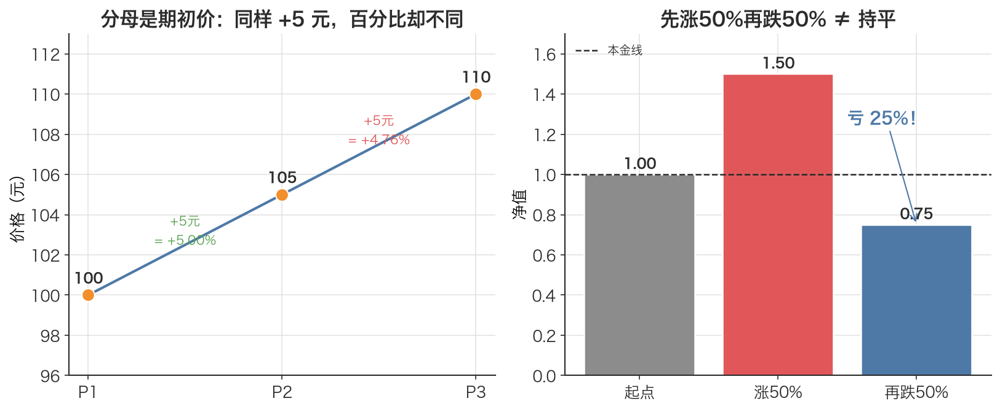

# 简单收益率 Simple Return

> 「我这笔买卖赚了百分之几？」——简单收益率就是把价格变化翻译成人人能懂的「涨跌幅」。

## 1. 探底 · 确认前置知识

这是本文（也是全书）的**起点概念**，没有显式数学前置。只要确认以下三件事：

- **会做除法和减法**：自测——若价格从 100 涨到 110，「涨了多少」和「涨了百分之几」分别是多少？（答案：10 和 10%）
- **懂百分比的含义**：自测——0.05 写成百分比是多少？25% 写成小数是多少？（答案：5%；0.25）
- **能在脑中区分「绝对变化」和「相对变化」**：自测——同样涨 10 元，对一只 10 元的股票和一只 1000 元的股票，意义一样吗？（答案：不一样，相对变化分别是 100% 和 1%）

如果以上都没问题，可以继续。这一篇会成为后续 [对数收益率 Log Return](./ch01-09-log-return.md)、[期望值 Expected Value](./ch01-03-expected-value.md)等概念的基石。

## 2. 建立动机 · 为什么需要它？

设想在比较两笔交易：A 股票买入价 8 元、卖出价 10 元；B 股票买入价 200 元、卖出价 210 元。

只看「赚了几块钱」会被误导：A 赚 2 元，B 赚 10 元，似乎 B 更好。但 A 的本金小，**单位本金的赚钱效率**完全不同。要公平比较不同价格、不同标的、不同时间段的盈亏，必须把「赚了多少钱」换算成「赚了百分之几」。这个百分比就是简单收益率。

如果没有这个统一标尺，会踩两个坑：

- **无法横向比较**：1000 元的茅台涨 10 元和 5 元的某小盘股涨 1 元，谁更猛？光看价格差永远说不清。
- **无法和指数对齐**：策略回测时要算「跑赢沪深300多少」，价格量级天差地别，只有收益率（无量纲的百分比）才能直接相减比较。

收益率把价格序列变成了**可比、无量纲**的序列，这是后面一切统计（期望、方差、年化）的入口。

## 3. 建立直觉 · 它「感觉上」是什么？

把它想成「投资回报率」：投进去一块钱，期末变成了多少？

- 期末变成 1.10 元 → 赚了 0.10 元 → 收益率 +10%
- 期末变成 0.95 元 → 亏了 0.05 元 → 收益率 −5%
- 期末还是 1.00 元 → 不赚不亏 → 收益率 0%

关键直觉：**收益率永远是相对于「期初本金」算的**。分母是出发时的价格，不是终点价格。这就像爬山时说「我比山脚高了多少百分比」，参照点是山脚（起点），不是山顶。

另一个直觉：简单收益率有个**硬下界 −100%**——价格最低跌到 0，最多亏光本金，不可能亏「110%」。但上界没有限制，可以 +50%、+200%。所以它天生**不对称**（向下封顶、向上敞开），这一点在第 7 节会成为坑。



*图：左边——价格 100→105→110，同样涨 5 元，但因为分母（基准）从 100 变成 105，第二期的百分比反而更小，说明收益率永远相对期初价；右边——先涨 50% 再跌 50%，净值掉到 0.75，亏 25%，并非「持平」，这就是涨跌幅陷阱。*

## 4. 给出定义 · 它精确是什么？

设资产在 t−1 时刻的价格为 $P_{t-1}$，在 t 时刻的价格为 $P_t$，则该期的**简单收益率** $r_t$ 定义为：

$$r_t = \frac{P_t - P_{t-1}}{P_{t-1}} = \frac{P_t}{P_{t-1}} - 1$$

逐符号解释：

- $P_{t-1}$：期初价格（分母 / 基准），单位是货币（如元）。必须 $> 0$。
- $P_t$：期末价格，单位同上。
- $P_t - P_{t-1}$：价格的绝对变化，单位还是元。
- $r_t$：本期简单收益率，**无量纲**（元 / 元，约掉了）。常写成小数（0.05）或百分比（5%）。

两种等价写法在本文配套代码里就是 `(p2 - p1) / p1`。其中 $p1 = P_{t-1}$、$p2 = P_t$。

**多期复合**（重要，区别于「相加」）：若连续 n 期收益率为 $r_1, \dots, r_n$，则期末总财富相对期初的倍数是它们的**连乘**：

总财富倍数 $= (1 + r_1)(1 + r_2)\dots(1 + r_n)$；总简单收益率 $= (1 + r_1)(1 + r_2)\dots(1 + r_n) - 1$。

注意是**乘**不是加。这是简单收益率最容易出错的地方，第 7 节展开。

## 5. 例题演算 · 手把手算一遍

沿用本文配套代码的价格序列：$P_1 = 100.0$, $P_2 = 105.0$, $P_3 = 110.0$。

**第 1 步：算第一期收益率（P1 → P2）**

$$r_1 = (105 - 100) / 100 = 5 / 100 = 0.05 \to +5.00\%$$

**第 2 步：算第二期收益率（P2 → P3）**

$$r_2 = (110 - 105) / 105 = 5 / 105 = 0.047619\dots \to +4.76\%$$

注意：同样是涨 5 元，因为基准从 100 变成 105，第二期的百分比反而更小。

**第 3 步：用「直接法」算两期总收益率（P1 → P3）**

$$r_{\text{total}} = (110 - 100) / 100 = 10 / 100 = 0.10 \to +10.00\%$$

**第 4 步：验证「能不能直接相加」**

$$r_1 + r_2 = 0.05 + 0.047619 = 0.097619 \to +9.76\%$$

$9.76\% \ne 10\%$！相差 0.24 个百分点。说明简单收益率**不能跨期相加**。

**第 5 步：验证「连乘」才对**

$$(1 + r_1)(1 + r_2) - 1 = 1.05 \times 1.047619 - 1 = 1.10 - 1 = 0.10 \to +10.00\% \quad \checkmark$$

连乘结果与直接法完全一致。这就是本文配套代码演示 2 里 `<-- 不相等！` 那一行想要点明的事实。

## 6. 你来做 · 即时练习

1. 某股票收盘价从 20 元跌到 18 元，简单收益率是多少（用百分比）？
2. 一只股票连续两天分别涨 10%、跌 10%。用连乘公式算两天的总简单收益率，是正、负还是 0？
3. 你以 50 元买入，期末 65 元卖出。简单收益率是多少？如果改用「卖出价当分母」算会得到什么（这是常见错误，体会一下差别）。

答案见文末折叠区。

## 7. 深化 · 边界与反常识

- **不能跨期相加**（最大的坑）：多期收益要**连乘** $(1+r_1)(1+r_2)\dots$，不是相加。这正是 [对数收益率 Log Return](./ch01-09-log-return.md) 存在的理由——对数收益率才满足时间可加性（见 [对数收益的时间可加性 Time-Additivity of Log Returns](./ch01-10-log-return-additivity.md)）。
- **算术平均会骗人**：先涨 50% 再跌 50%，算术平均收益率 $= (50\% - 50\%) / 2 = 0\%$，但实际净值 $= 1.5 \times 0.5 = 0.75$，**亏了 25%**。本文配套代码演示 3 专门演示了「涨5%跌5%」这个净值陷阱。
- **不对称分布**：下界被钉死在 −100%，上界无限。这让简单收益率的分布右偏，做正态分布假设时不如对数收益率干净。
- **与对数收益率在小幅度时近似相等**：当 $r$ 很小时，$\ln(1 + r) \approx r$。比如 $r = 0.01$ 时，对数收益率 $\approx 0.00995$，差异在第三位小数。但 r 越大（如 ±20%），两者差异越显著，不能混用。
- **方向参照点固定**：分母必须是**期初**价格。把分母写成期末价格是初学者高频错误（见练习 3）。

## 8. 联系 · 它在数学地图里的位置

**上游依赖**：无——它是本文乃至整个数学地图的入口概念之一，只用到小学算术。

**下游用途**（它喂给谁）：

- [对数收益率 Log Return](./ch01-09-log-return.md)：直接对标的「另一种收益率」，关系是 $r_{\log} = \ln(1 + r_{\text{simple}})$。
- [期望值 Expected Value](./ch01-03-expected-value.md)、[方差 Variance](./ch01-04-variance.md)、[标准差 Standard Deviation](./ch01-05-standard-deviation.md)：把一串简单收益率当成 [随机变量 Random Variable](./ch01-01-random-variable.md)的样本，就能算它们的均值与波动。
- [样本均值 Sample Mean](./ch01-06-sample-mean.md)：实务中用历史收益率序列估计平均收益。
- [复利效应 Compounding Effect](./ch01-11-compounding-effect.md)：多期连乘的本质就是复利。
- [年化 Annualization](./ch01-12-annualization.md)：把单期收益率换算到年度尺度。

## 9. 应用 · 量化与算法交易在哪里用它？

- **回测里的收益序列**：本文配套代码用 `close.pct_change()`（pandas 内置的简单收益率）一行算出沪深300的日简单收益率序列 `simple_rets`，再与对数收益率对比。`pct_change()` 算的就是本篇公式 $P_t / P_{t-1} - 1$。
- **绩效汇报**：向非技术客户/PM 解释「这个月策略赚了 3.2%」时，用的就是简单收益率——它直觉、可读。本文配套代码也保留了 `simple_return(p1, p2)` 这个纯 Python 实现供手算对照。
- **风控阈值**：止损规则常写成「单笔亏损达 −5% 平仓」，这里的 −5% 就是简单收益率，因为它有清晰的 −100% 下界，符合「最多亏光本金」的真实约束。
- **未来函数防护**：算交易信号时务必用 `shift(1)` 把信号延迟一天再乘到「次日收益率」上，绝不能用当天收益率反推当天信号——那是用未来数据作弊。本文配套代码的注释明确提醒「信号需 shift(1) 延迟一天执行」。
- **数据口径**：A 股回测一律用**前复权（qfq）**价格算收益率，否则除权日会凭空冒出巨大假跳空。本文配套代码下载沪深300时设 `adjust="qfq"` 正是此意。

一个最小可复现片段（与本文配套代码一致的口径）：

```python
import akshare as ak
import pandas as pd

raw = ak.index_zh_a_hist(symbol="000300", period="daily",
                         start_date="20230101", end_date="20231231",
                         adjust="qfq")  # A股用前复权
raw = raw.rename(columns={"日期": "date", "收盘": "close"})
raw["date"] = pd.to_datetime(raw["date"])
close = raw.set_index("date").sort_index()["close"]

simple_rets = close.pct_change().dropna()   # 简单收益率序列 = P_t/P_{t-1} - 1
print(simple_rets.head())
```

## 10. 复盘 · 用输出倒逼输入

回答得出下面三个问题，就说明你掌握了：

1. 简单收益率的分母是期初还是期末价格？为什么换成期末会得到无意义的结果？
2. 为什么简单收益率「不能跨期相加」，正确的多期复合公式长什么样？
3. 「先涨 50% 再跌 50% 不等于持平」，用一句话和一个算式说清楚原因。

**费曼式复述任务**：向一个完全不懂金融、只会算百分比的朋友，用 30 秒讲清「简单收益率是什么、为什么它比『赚了几块钱』更有用、以及它有一个会坑人的地方」。

---

<details>
<summary>第 6 节练习答案</summary>

1. $r = (18 - 20) / 20 = -2 / 20 = -0.10 = -10\%$。
2. $(1 + 0.10)(1 - 0.10) - 1 = 1.10 \times 0.90 - 1 = 0.99 - 1 = -0.01 = -1\%$。**是负的**——先涨后跌（或先跌后涨）同幅度，必然亏损，这就是「涨跌幅陷阱」。
3. 正确：$(65 - 50) / 50 = 15 / 50 = 0.30 = +30\%$。错误地用卖出价当分母：$(65 - 50) / 65 = 15 / 65 \approx 0.2308 = 23.08\%$，偏小且毫无金融意义。**分母永远是期初价格**。

</details>