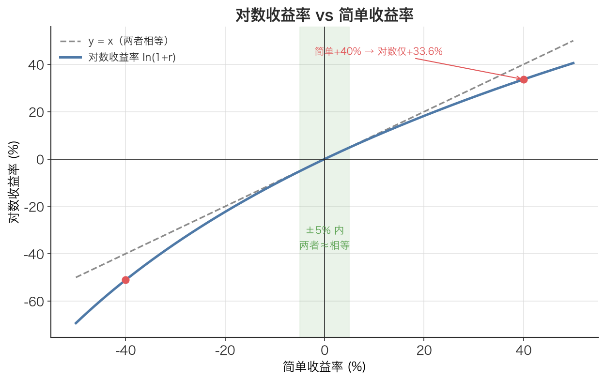

# 对数收益率 Log Return

> 把价格取个对数，多期收益率就能像搭积木一样直接相加——这就是量化金融偏爱它的全部秘密。

## 1. 探底 · 确认前置知识

读这篇前，请确认能脱口而出下面这些：

- [简单收益率 Simple Return](./ch01-08-simple-return.md)：自测——「价格从 100 涨到 105，简单收益率是多少？公式怎么写？」答不出就先回去看这一篇，本文几乎每一步都在和它对照。
- 高中对数：自测——「$\ln(a/b)$ 等于什么？$\ln(a) + \ln(b)$ 又等于什么？」（答：$\ln(a) - \ln(b)$；$\ln(a \cdot b)$）。如果忘了 $\ln$ 是以 e 为底的自然对数，先复习对数运算律，否则第 4 节的推导会卡住。
- 指数函数：自测——「$e^0$ 是多少？$e^x$ 是增函数还是减函数？」（答：1；增函数）。我们会用 $e^x$ 把对数收益率还原回简单收益率。

这三块缺一不可。对数收益率本质上就是「对简单收益率换了一套坐标系」，所以必须先牢牢掌握简单收益率。

## 2. 建立动机 · 为什么需要它？

在回测一个策略，手里有沪深300过去 3 年约 730 个交易日的日收益率。现在想知道「这 3 年总共赚了多少」。

如果用简单收益率，不能把 730 个数字直接加起来——那是错的，必须做连乘：`(1+r₁)(1+r₂)…(1+r₇₃₀) − 1`。连乘 730 个接近 1 的浮点数，不仅写起来啰嗦，数值上还容易积累误差。

更糟的是统计建模。要算「日收益率的均值和标准差，然后年化」，可简单收益率不可加，意味着「日均值 × 252」在数学上根本不对应任何真实的年收益。本文开篇那个「涨50%再跌50%，算术平均说持平、实际亏25万」的故事，就是直接拿简单收益率做加减平均踩的坑。

对数收益率把「连乘」变成「连加」，把这些坑一次性填平。这是处理历史序列、做统计的标准工具。

## 3. 建立直觉 · 它「感觉上」是什么？

想象在爬楼梯，每一级台阶高度不同。简单收益率回答的是「这一级比上一级高了百分之几」；对数收益率回答的是「在『对数高度』这把尺子上，往上挪了多少格」。

关键在于这把「对数尺子」：它把「乘法」变成了「加法」。在普通尺子上，价格从 100 到 110 是「乘以 1.1」；换到对数尺子上，就变成「加上 ln(1.1) ≈ 0.0953 格」。

所以,当价格连续走 100 → 105 → 110，在对数尺子上走的就是两段位移，把两段位移相加，自然等于从 100 直接到 110 的总位移。普通收益率做不到这点，因为乘法不能简单相加。

还有一个直觉：当涨跌幅很小（日内常见的 ±1%~2%），对数尺子和普通尺子几乎重合，两种收益率数值上差不多。只有在大涨大跌时，两把尺子才明显分开。



*图：对数收益率曲线 ln(1+r) 与对角线 y=x 的关系。在 ±5% 的小幅度区间内两者几乎重合（绿色阴影），可以混用；但在大涨大跌时明显分叉——简单 +40% 对应的对数收益只有 +33.6%，正收益时对数恒小于简单。*

## 4. 给出定义 · 它精确是什么？

单期对数收益率定义为相邻两期价格之比的自然对数：

$$r_t = \ln(P_t / P_{t-1}) = \ln(P_t) - \ln(P_{t-1})$$

符号逐一解释：

- $P_t$：第 t 期的价格（如某日收盘价），单位是元（A股用前复权 qfq 价格，避免分红送股造成的虚假跳空）。
- $P_{t-1}$：上一期价格，同样单位元。
- $\ln$：自然对数（以 $e \approx 2.71828$ 为底）。
- $r_t$：本期对数收益率，无量纲（是个纯数）。日频数据里通常是 0.0x 量级。

它和简单收益率 $r_{\text{simple}} = P_t/P_{t-1} - 1$ 的精确换算关系是：

$$\begin{aligned}
r_{\log} &= \ln(1 + r_{\text{simple}}) \\
r_{\text{simple}} &= e^{r_{\log}} - 1
\end{aligned}$$

核心性质——**时间可加性**。对任意三期价格 $P_1$、$P_2$、$P_3$：

$$\ln(P_3/P_1) = \ln(P_2/P_1) + \ln(P_3/P_2)$$

因为 $\ln(P_3/P_1) = \ln(P_3) - \ln(P_1) = [\ln(P_2)-\ln(P_1)] + [\ln(P_3)-\ln(P_2)]$，中间项 $\ln(P_2)$ 一加一减抵消。这就是「多期对数收益率之和 = 总对数收益率」的全部数学来源。

## 5. 例题演算 · 手把手算一遍

沿用本文的经典三日价格：$P_1 = 100$，$P_2 = 105$，$P_3 = 110$。

第一步，算两段单期对数收益率：

$$\begin{aligned}
r_1 &= \ln(105/100) = \ln(1.05)    \approx 0.048790 \\
r_2 &= \ln(110/105) = \ln(1.047619) \approx 0.046520
\end{aligned}$$

第二步，把两段相加：

$$r_1 + r_2 \approx 0.048790 + 0.046520 = 0.095310$$

第三步，直接算从 P₁ 到 P₃ 的总对数收益率：

$$r_{\text{total}} = \ln(110/100) = \ln(1.1) \approx 0.095310$$

第四步，对比：$0.095310 = 0.095310$ ✓ 完全相等。这就验证了时间可加性。

对照一下简单收益率的失败：$r_1 = 5\%$、$r_2 = 4.762\%$，直接相加得 9.762%，但真实总简单收益是 $(110-100)/100 = 10\%$，差了 0.238%——简单收益率不可加，必须用连乘 $1.05 \times 1.047619 = 1.1$。

最后还原成简单收益率验证答案合理：$e^{0.095310} - 1 \approx 1.1 - 1 = 0.10$，正是 10% 的总收益，自洽。

## 6. 你来做 · 即时练习

1. 价格从 50 涨到 55，单期对数收益率是多少？（保留 6 位小数）
2. 某资产连续两天对数收益率为 +0.03 和 −0.05。这两天的总对数收益率是多少？换算成总简单收益率约为多少？
3. 已知某日对数收益率 $r_{\log} = 0.01$。它对应的简单收益率比 $r_{\log}$ 大还是小？为什么大涨时两者差距会拉大？

答案见文末折叠区。

## 7. 深化 · 边界与反常识

- **价格必须为正**。`ln` 在 0 和负数上没有定义。本文配套代码的 `log_return` 函数显式检查 `if p1 <= 0 or p2 <= 0: raise ValueError`。期货、价差等可能为负的标的不能直接套对数收益率。
- **对数收益率会比简单收益率「偏小」**（在正收益时）。常见误解是「两者随便用都行」。在单期、小幅度时确实近似相等，但累积多期或大涨大跌时，差异会显现，混用会导致回测净值算错。
- **截面比较别用对数收益率**。某一天比较一篮子股票谁涨得多、做横截面排序时，简单收益率才是直觉对应的「赚了百分之几」。对数收益率的优势在「时间方向」上可加，不在「横截面」上。
- **年化要分清乘数**。对数收益率均值年化是 $\times 252$（因为可加），但波动率年化是 $\times \sqrt{252}$（[时间平方根法则 Square-Root-of-Time Rule](./ch01-13-sqrt-time-rule.md)）。把波动率也乘 252 是经典错误。
- 与近邻概念的区别：[简单收益率 Simple Return](./ch01-08-simple-return.md) 直觉友好、可向客户解释、可做截面比较；对数收益率适合时间序列求和与统计建模。两者不是对错关系，是分工关系。

## 8. 联系 · 它在数学地图里的位置

上游依赖：

- [简单收益率 Simple Return](./ch01-08-simple-return.md)：对数收益率是它的对数变换，$r_{\log} = \ln(1 + r_{\text{simple}})$。
- [随机变量 Random Variable](./ch01-01-random-variable.md)：每日对数收益率本身就是一个随机变量，后续所有统计都建立在此之上。

下游用途：

- [对数收益的时间可加性 Time-Additivity of Log Returns](./ch01-10-log-return-additivity.md)：本概念最重要的性质，单独成篇深入。
- [期望值 Expected Value](./ch01-03-expected-value.md)、[方差 Variance](./ch01-04-variance.md)、[标准差 Standard Deviation](./ch01-05-standard-deviation.md)：直接作用在对数收益率序列上，得到日均收益与波动率。
- [年化 Annualization](./ch01-12-annualization.md) 与 [时间平方根法则 Square-Root-of-Time Rule](./ch01-13-sqrt-time-rule.md)：把日频对数收益统计量放大到年频。
- [复利效应 Compounding Effect](./ch01-11-compounding-effect.md)：对数收益与连续复利一一对应。

## 9. 应用 · 量化与算法交易在哪里用它？

- **回测净值与策略评估**：算多年累计收益时，对数收益率序列直接 `.sum()` 即得总对数收益，再用 `e^x − 1` 还原成总简单收益，避免连乘的数值误差。本文配套代码「演示 3」就用 `math.log(1.05) + math.log(0.95)` 这个负值，正确揭穿了「涨5%跌5%净值不变」的假象。
- **波动率与风控**：风控系统几乎一律用对数收益率估波动率。本文配套代码用 numpy 一行计算：

```python
import numpy as np
# close 为前复权收盘价序列；shift(1) 保证只用昨天及更早的数据，绝不引入未来信息
log_rets = np.log(close / close.shift(1)).dropna()
ann_vol  = log_rets.std() * np.sqrt(252)   # 年化波动率：√252 法则
```

注意 `shift(1)`：计算第 t 天收益用的是 t 和 t−1 的价格，任何基于它的信号都要再延迟一天执行，杜绝未来函数。

- **统计建模**：对数收益率取值范围理论上是 $(-\infty, +\infty)$，更接近正态分布，是 GARCH、协方差矩阵、VaR 等模型的标准输入。
- **手算与库的互验**：本文配套代码用纯 Python 的 `log_return(price_list[i-1], price_list[i])` 逐日算出对数收益列表，再用等概率离散分布套 `expected_value` / `std_dev`，结果与 numpy 的 `log_rets.mean()`、`log_rets.std()` 几乎完全一致（波动率的极小差异来自 ddof 自由度，见 [贝塞尔校正（n-1） Bessel's Correction](./ch01-07-bessels-correction.md)）。

## 10. 复盘 · 用输出倒逼输入

能清楚回答下面三问，就算掌握了：

1. 为什么对数收益率可以多期直接相加，而简单收益率不行？（要能写出 $\ln(P_3/P_1) = \ln(P_2/P_1) + \ln(P_3/P_2)$ 并说出中间项抵消）
2. 对数收益率和简单收益率如何互相换算？什么情况下两者近似相等、什么情况下明显分开？
3. 年化对数收益率均值和年化波动率，分别乘以什么？为什么一个是 252、一个是 √252？

费曼式复述任务：用 60 秒、不看公式，向一个只会编程不懂金融的朋友讲清楚「为什么量化里算多年收益要先把价格取对数」。讲到对方能复述「连乘变连加」，你就真懂了。

---

<details>
<summary>第 6 节练习答案</summary>

1. $\ln(55/50) = \ln(1.1) \approx 0.095310$。
2. 对数可加，直接相加：$0.03 + (-0.05) = -0.02$。换算简单收益率：$e^{-0.02} - 1 \approx -0.0198$，约 −1.98%（小幅度时与 −0.02 接近）。
3. 简单收益率更大。因为 $r_{\text{simple}} = e^{r_{\log}} - 1$，而 $e^x \ge 1 + x$（泰勒展开 $e^x = 1 + x + x^2/2 + \dots$，二次项及以后都为正），所以 $r_{\text{simple}} \ge r_{\log}$。涨幅越大，$x^2/2$ 等高阶项越显著，差距越大。

</details>