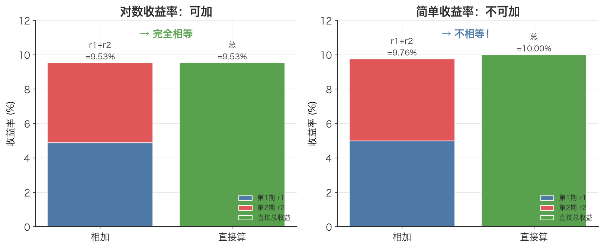

# 对数收益的时间可加性 Time-Additivity of Log Returns

> 把每天的对数收益率直接相加，就等于整段时期的总对数收益率——加法代替了恼人的连乘。

## 1. 探底 · 确认前置知识

读这篇前，请先确认真的懂下面这个概念。看不懂自测题就先回去补：

- [对数收益率 Log Return](./ch01-09-log-return.md)：单期对数收益率定义为 $r = \ln(P_t / P_{t-1})$。
  - 自测题：某股票昨天收盘 100 元，今天收盘 105 元，它今天的对数收益率是多少？（答案约 0.04879，即 $\ln(1.05)$。算不出来说明还没掌握 $\ln$ 与价格比值的关系。）

另外还需要会一点高中数学里的对数运算法则，尤其是这一条：

$$\begin{aligned}
\ln(a) + \ln(b) &= \ln(a \times b) \\
\ln(a / b)     &= \ln(a) - \ln(b)
\end{aligned}$$

整篇文章的「魔法」其实全靠上面这一行恒等式。如果这条法则还很陌生，先复习对数再回来。

## 2. 建立动机 · 为什么需要它？

假设回测一个策略，跑了 3 年、约 750 个交易日，每天产出一个收益率。现在想知道这 3 年总共赚了多少。

如果用**简单收益率**，不能把 750 个数字加起来，必须做连乘（复合）：

总收益 $= (1 + r_1)(1 + r_2)\dots(1 + r_{750}) - 1$

连乘有两个现实痛点：

1. **数值不稳定**：750 个接近 1 的数相乘，浮点误差会逐步累积；如果中间有缺失值或异常值，整条链路全废。
2. **统计学不友好**：要算「日均收益」「收益的方差」「年化」，这些统计量都是为**加法**设计的。对乘法序列求均值方差，公式立刻变得很丑。

真实翻车场景：一位新手把每天的简单收益率直接相加当作总收益汇报，3 年累计误差可达几个百分点；评估两个策略时，这点误差足以让排名颠倒，于是他上线了那个其实更差的策略。

对数收益的时间可加性，就是把「连乘」变回「相加」的工具——一旦换成对数收益率，750 天的总收益就是简单的 `sum()`。

## 3. 建立直觉 · 它「感觉上」是什么？

想象在爬楼梯，每一层的「高度」用对数刻度来量。

- 简单收益率像是在说「这一层比上一层高了百分之几」——百分比是相对的，没法直接累加（在 100 元基础上的 5% 和在 200 元基础上的 5% 不是同一个绝对台阶）。
- 对数收益率把价格搬到「对数高度」这把尺子上。在这把尺子上，**每一段路程的长度可以首尾相接、直接相加**，因为它量的是「对数高度的变化量」，而变化量天生可加：从 1 楼到 2 楼，再从 2 楼到 3 楼，总共就是从 1 楼到 3 楼，中间的 2 楼被消掉了。

一句话直觉：**对数把「比值的连乘」翻译成「差值的累加」**。价格序列原本是不断相乘的（涨 5% 就是乘 1.05），取对数之后就变成不断相加的——这正是望远镜般的简化。



*图：价格 100→105→110。左边——两期对数收益率相加（9.53%）与直接算的总对数收益（9.53%）完全相等；右边——两期简单收益率相加得 9.76%，却不等于真实总收益 10.00%。这就是「对数收益率可加、简单收益率不可加」的直观证据。*

## 4. 给出定义 · 它精确是什么？

设价格序列为 $P_0, P_1, P_2, \dots, P_n$。第 t 期的对数收益率定义为：

$$r_t = \ln(P_t / P_{t-1}) = \ln(P_t) - \ln(P_{t-1})$$

**时间可加性**断言：从 P₀ 到 P_n 的总对数收益率，等于各期对数收益率之和。

$$R_{\text{total}} = \ln(P_n / P_0) = \sum_{t=1}^{n} r_t = r_1 + r_2 + \dots + r_n$$

符号说明：

- $P_t$：第 t 个时刻的价格，单位是货币（如元）。必须为正数，否则 $\ln$ 无定义。A 股请用**前复权（qfq）**价格，避免除权除息造成的虚假跳变。
- $r_t$：第 t 期对数收益率，无量纲（是一个纯数，如 0.0488）。
- $R_{\text{total}}$：整段 n 期的总对数收益率，同样无量纲。
- $\sum$：求和符号，把 r_1 到 r_n 全部加起来。

为什么成立？把各项展开，相邻项首尾相消（望远镜求和）：

$$\begin{aligned}
\sum r_t &= [\ln P_1 - \ln P_0] + [\ln P_2 - \ln P_1] + \dots + [\ln P_n - \ln P_{n-1}] \\
       &= \ln P_n - \ln P_0 \\
       &= \ln(P_n / P_0)
\end{aligned}$$

中间所有 $\ln P_1, \ln P_2, \dots, \ln P_{n-1}$ 一正一负全部抵消，只剩头和尾。这就是可加性的全部证明。

## 5. 例题演算 · 手把手算一遍

沿用本文配套代码中的同一组数字：$P_1=100$, $P_2=105$, $P_3=110$。

**第 1 步：算各期对数收益率**

$$\begin{aligned}
r_1 &= \ln(105 / 100) = \ln(1.05)     \approx 0.048790 \\
r_2 &= \ln(110 / 105) = \ln(1.047619) \approx 0.046520
\end{aligned}$$

**第 2 步：把它们相加**

$$r_1 + r_2 \approx 0.048790 + 0.046520 = 0.095310$$

**第 3 步：直接算总对数收益率（绕开中间价格）**

$$R_{\text{total}} = \ln(110 / 100) = \ln(1.1) \approx 0.095310$$

**第 4 步：核对**——两者完全相等（误差在浮点精度内，约 1e-16）。可加性验证成功。

对照一下简单收益率（故意做反例）：

- 简单 $r_1 = (105-100)/100 = 5.00\%$
- 简单 $r_2 = (110-105)/105 \approx 4.76\%$
- 直接相加 $= 9.76\%$（错！）
- 真实总简单收益 $= (110-100)/100 = 10.00\%$

简单收益率相加得到 9.76%，与真实的 10.00% 差了 0.24 个百分点；而对数收益率相加分毫不差。

## 6. 你来做 · 即时练习

试着自己动手，答案在文末折叠区。

1. 某股票三天价格为 100、102、99。分别算两天的对数收益率，求和，再和 `ln(99/100)` 直接计算的结果比较，验证可加性。
2. 已知某资产 5 天的对数收益率分别为 0.01、−0.02、0.015、0.00、0.005，请求出这 5 天的总对数收益率，并换算成「净值增长了百分之几」（提示：总简单收益 $= e^{R_{\text{total}}} - 1$）。
3. 概念题：连续 252 个交易日，每天对数收益率都恰好是 0.0004。这一年的总对数收益率是多少？再换算成年化简单收益率约是多少？（这正是 [年化 Annualization](./ch01-12-annualization.md) 的内核。）

答案见文末折叠区。

## 7. 深化 · 边界与反常识

- **可加性是时间维度的，不是资产维度的**。一个投资组合在某一天的对数收益率，**不等于**各成分股对数收益率的加权和（组合的简单收益率才满足加权求和）。跨时间能加，跨资产不能加——这是最常见的混淆。
- **对数收益率不能直接做权重加权平均得到组合收益**。要算组合当期收益，先用简单收益率加权，再（如有需要）转回对数。参考 [简单收益率 Simple Return](./ch01-08-simple-return.md) 与 [对数收益率 Log Return](./ch01-09-log-return.md) 的取舍。
- **价格必须为正**。出现 0 或负价（数据错误、未做复权的除权跳空）会让 `ln` 报错或产生异常值。务必用前复权数据。
- **小幅度时 ≈ 简单收益率，大幅度时差异显著**。$\ln(1+x) \approx x - x^2/2$，当单期波动很大（如个股单日 ±20%）时，对数收益率和简单收益率会明显分叉，别混用。
- **可加 ≠ 期望可加里的陷阱**。对数收益率的均值年化用「$\times 252$」（因为可加），但波动率年化要用「$\times \sqrt{252}$」，这是 [时间平方根法则 Square-Root-of-Time Rule](./ch01-13-sqrt-time-rule.md)，两者法则不同，不要张冠李戴。

## 8. 联系 · 它在数学地图里的位置

**上游依赖：**

- [对数收益率 Log Return](./ch01-09-log-return.md)：本概念的直接前置，单期定义就来自这里。
- 高中对数运算法则 $\ln(a)+\ln(b)=\ln(ab)$：可加性的代数根基。

**下游用途：**

- [年化 Annualization](./ch01-12-annualization.md)：日均对数收益率 $\times 252$ 得到年化收益率，正是靠可加性才能用乘法。
- [复利效应 Compounding Effect](./ch01-11-compounding-effect.md)：可加性是「连续复利」在对数世界里的另一面。
- [时间平方根法则 Square-Root-of-Time Rule](./ch01-13-sqrt-time-rule.md)：在「各期独立同分布」假设下，对数收益率求和的方差按 n 缩放，标准差按 √n 缩放。
- [期望值 Expected Value](./ch01-03-expected-value.md)、[方差 Variance](./ch01-04-variance.md)：对可加的对数收益率序列做统计建模的基础。

## 9. 应用 · 量化与算法交易在哪里用它？

**回测累计收益**：策略每天产出一条对数收益率，整段回测的总收益直接 `log_rets.sum()`，无需连乘。本文配套代码的「演示 2」就直接验证了这一点：

```python
P1, P2, P3 = 100.0, 105.0, 110.0
lr1 = log_return(P1, P2)
lr2 = log_return(P2, P3)
total_log_direct = log_return(P1, P3)
# 直接相加 lr1+lr2 与 total_log_direct 完全相等，差异 ~1e-16
```

**年化**：本文配套代码用可加性把日均对数收益率乘 252 得到年化收益率（注意波动率用 √252）：

```python
log_rets = np.log(close / close.shift(1)).dropna()   # 信号/收益均 shift(1)，不使用未来数据
ann_ret  = log_rets.mean() * 252        # 收益率年化：× 252（靠可加性）
ann_vol  = log_rets.std()  * np.sqrt(252)  # 波动率年化：× √252（平方根法则）
```

数据按要求用沪深300前复权（`adjust="qfq"`），且 `close.shift(1)` 保证当天收益只用到截至当天的信息，回测时信号一律延迟一天执行，杜绝未来函数。

**风控**：风险系统常把多日持仓的累计风险用对数收益率累加来近似，因为可加性让多期 VaR/波动率的推导在数学上干净许多。

**滚动指标**：计算滚动 N 日累计收益时，对数收益率用滚动求和（`rolling(N).sum()`）即可，比滚动连乘更稳更快。

## 10. 复盘 · 用输出倒逼输入

能脱口答出下面三个问题，就算掌握了：

1. 为什么对数收益率能在时间上相加，而简单收益率不能？（关键词：望远镜求和、$\ln(ab)=\ln a+\ln b$。）
2. 「跨时间可加」和「跨资产可加」哪个对对数收益率成立？哪个对简单收益率成立？
3. 既然收益率可加（× 252），为什么波动率年化却是 × √252 而不是 × 252？

费曼式复述任务：用一句不含公式的话，向一个只懂加减乘除的朋友解释——为什么把价格取对数之后，多天的收益就能像账本一样一行行加起来。

---

<details>
<summary>第 6 节练习答案</summary>

**第 1 题**
- $r_1 = \ln(102/100) = \ln(1.02) \approx 0.019803$
- $r_2 = \ln(99/102) = \ln(0.970588) \approx -0.029853$
- 求和 $\approx 0.019803 + (-0.029853) = -0.010050$
- 直接计算：$\ln(99/100) = \ln(0.99) \approx -0.010050$ ✓ 完全相等，可加性成立。

**第 2 题**
- $R_{\text{total}} = 0.01 - 0.02 + 0.015 + 0.00 + 0.005 = 0.010$
- 净值增长 $= e^{0.010} - 1 \approx 0.01005$，即约 +1.005%。

**第 3 题**
- 总对数收益率 $= 252 \times 0.0004 = 0.1008$。
- 年化简单收益率 $= e^{0.1008} - 1 \approx 0.10606$，即约 +10.61%。
（这说明对数收益率年化用乘法 $\times 252$，再用 e 转回简单收益率。）

</details>
