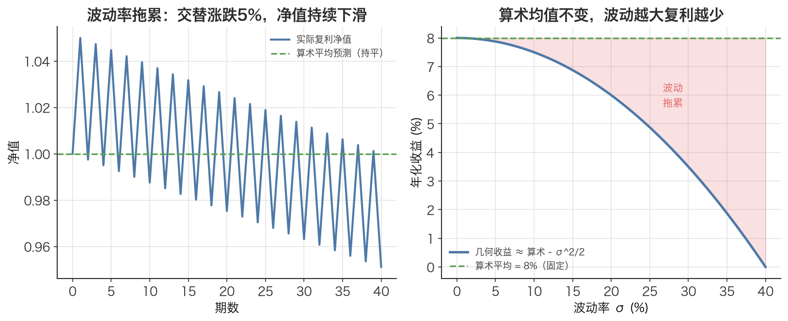

# 复利效应 Compounding Effect

> 收益不是相加的，而是相乘的——每一期的收益都站在上一期的肩膀上，所以「平均涨跌」会骗人，真正决定财富的是**乘积**。

## 1. 探底 · 确认前置知识

读这篇前，应该已经掌握：

- [简单收益率 Simple Return](./ch01-08-simple-return.md)：$r = P_t / P_{t-1} - 1$。
  - 自测：连续两天各涨 5%，第二天的「5%」是相对于哪个价格算的？（答案：第一天涨完后的新价格，不是初始价格。）
- [对数收益率 Log Return](./ch01-09-log-return.md)：$r = \ln(P_t / P_{t-1})$。
  - 自测：为什么对数收益率可以「多期直接相加」，而简单收益率不行？（答案：$\ln(a \cdot b) = \ln(a) + \ln(b)$，对数把乘积变成了求和。）

如果上面两题答不上来，先回去看那两篇——复利效应本质上就是「简单收益率必须相乘」这件事的展开。

## 2. 建立动机 · 为什么需要它？

回到本文开头那个故事：李明第一年赚 50%、第二年亏 50%，他汇报「平均收益 0%，持平」。

但真实账户是：

```text
100万 → ×1.5 → 150万 → ×0.5 → 75万
```

亏了 25 万，却被说成「持平」。这就是不理解复利效应的代价：**把该相乘的收益当成了相加。**

在量化里这个坑无处不在：
- 回测报告里写「日均收益 0.1%」，顺手 `0.1% × 252 = 25.2%` 当成年化，结果实盘对不上。
- 两个策略日均收益相同，但波动大的那个长期净值反而更低——因为波动会「吃掉」复利。

不理解复利，就会系统性高估收益、低估风险，最终对策略下错判断。

## 3. 建立直觉 · 它「感觉上」是什么？

想象一个滚雪球：雪球越大，每滚一圈粘上的雪越多。第二圈粘的雪，是粘在「已经变大的雪球」上的。这就是复利——**增长建立在上一轮的结果之上，而不是建立在起点之上。**

关键反直觉点：**先涨 X% 再跌 X%，不会回到原点，而是会亏损。**

- 涨 10% 再跌 10%：$1.0 \times 1.1 \times 0.9 = 0.99$ → 亏 1%
- 涨 50% 再跌 50%：$1.0 \times 1.5 \times 0.5 = 0.75$ → 亏 25%

因为下跌时的「X%」是作用在更大的基数上的。波动越大，这个「来回挨打」的损失越严重——这叫**波动率拖累（volatility drag）**。



*图：左边——每期交替涨 5%/跌 5%，算术平均说「持平」（绿色虚线），实际复利净值却持续下滑；右边——固定算术平均收益不变，波动率 σ 越大，几何（真实复利）收益越低，缺口约为 σ²/2，这就是波动率拖累。*

## 4. 给出定义 · 它精确是什么？

设某资产连续 n 期的简单收益率为 $r_1, r_2, \dots, r_n$，初始净值为 $V_0$。复利下的终值净值为（$\prod$ 表示连乘）：

$$\begin{aligned}
V_n &= V_0 \times (1 + r_1) \times (1 + r_2) \times \dots \times (1 + r_n) \\
    &= V_0 \times \prod (1 + r_i)
\end{aligned}$$

- $V_0$：初始净值（单位：元，或归一化为 1）。
- $r_i$：第 i 期简单收益率（无量纲，如 0.05 表示 +5%）。
- $(1 + r_i)$：第 i 期的**增长因子**（gross return），如涨 5% 对应 1.05。
- $\prod$：连乘符号，把所有增长因子乘起来。

总简单收益率：

$$R_{\text{total}} = V_n / V_0 - 1 = \prod (1 + r_i) - 1$$

**与对数收益率的桥梁**——这是复利效应的数学核心。对乘积取对数，乘积变求和：

$$\ln(V_n / V_0) = \ln \prod (1 + r_i) = \sum \ln(1 + r_i) = \sum r_{\log, i}$$

也就是说，[对数收益率 Log Return](./ch01-09-log-return.md) 之所以可加，正是因为复利下净值是相乘的（见本文第 3 节的可加性推导）。

## 5. 例题演算 · 手把手算一遍

沿用本文配套代码「演示 3」的数字：初始净值 1.0，先涨 5%，再跌 5%。

**第 1 步：写出增长因子**

- $r_1 = +5\%$ → 增长因子 $= 1 + 0.05 = 1.05$
- $r_2 = -5\%$ → 增长因子 $= 1 + (-0.05) = 0.95$

**第 2 步：连乘求终值**

$$V_2 = 1.0 \times 1.05 \times 0.95 = 0.9975$$

**第 3 步：算总收益率**

$$R_{\text{total}} = 0.9975 / 1.0 - 1 = -0.0025 = -0.25\%$$

**第 4 步：和「算术平均」对比，看陷阱**

- 算术平均收益 $= (0.05 + (-0.05)) / 2 = 0$（误导！显示持平）
- 真实复利结果 $= -0.25\%$（实际亏损）

**第 5 步：用对数收益率验证（对应本文配套代码的 log_total）**

$$\begin{aligned}
\text{log\_total} &= \ln(1.05) + \ln(0.95) \\
          &= 0.048790 + (-0.051293) \\
          &= -0.002503
\end{aligned}$$

验证：$\ln(0.9975) = -0.002503$ ✓ 完全一致。

结论：净值 $0.9975 \ne 1$，复利效应把「看似持平」变成了真实亏损 0.25%。

## 6. 你来做 · 即时练习

1. 某基金三年收益率分别为 +30%、-20%、+10%。用复利公式算三年累计总收益率（保留两位小数）。
2. 一个策略每天稳赚 +1%，连续 20 个交易日。用复利算累计收益，并和「简单相加 1%×20 = 20%」对比，差多少？
3. 资产 A 每年 +20%/-20% 交替，资产 B 每年稳定 0%。两年后谁的净值高？为什么？（这题考波动率拖累。）

答案见文末折叠区。

## 7. 深化 · 边界与反常识

- **「平均收益率」有两种，别混用。** 算术平均（直接求和÷n）适合描述「下一期的期望收益」；几何平均（$\left(\prod(1+r_i)\right)^{1/n} - 1$）才反映「实际复利增长率」。报告业绩用几何平均，否则就是李明那种自欺。
- **波动率拖累是真实成本。** 近似关系：几何平均 $\approx$ 算术平均 $- \sigma^2/2$。同样的算术平均收益，波动 $\sigma$ 越大，实际到手的复利收益越低。这就是为什么量化里不能只看收益、必须看 $\sigma$（见 [方差 Variance](./ch01-04-variance.md)、[标准差 Standard Deviation](./ch01-05-standard-deviation.md)）。
- **小收益时复利 ≈ 相加，别小题大做。** 当各期 $r_i$ 都很小（如日内 0.1%），$\prod(1+r_i) \approx 1 + \sum r_i$，误差可忽略。复利的威力体现在**期数多**或**单期幅度大**时。
- **常见误解：年化收益 = 日均 × 252。** 错。日均**简单**收益率不能直接乘 252（那是相加逻辑）。正确做法是先转成 [对数收益率 Log Return](./ch01-09-log-return.md) 再 $\times 252$（可加），或用几何方式「(1+日均)$^{252}$ − 1」。这正是本文 [年化 Annualization](./ch01-12-annualization.md) 的重点。

## 8. 联系 · 它在数学地图里的位置

**上游依赖：**
- [简单收益率 Simple Return](./ch01-08-simple-return.md)：复利的「积木」是每一期的简单收益率。
- [对数收益率 Log Return](./ch01-09-log-return.md)：取对数后，复利的「乘」变成「加」，是复利效应的对偶视角。

**下游用途：**
- [对数收益的时间可加性 Time-Additivity of Log Returns](./ch01-10-log-return-additivity.md)：直接由复利的乘积结构推出。
- [年化 Annualization](./ch01-12-annualization.md)：把单期复利推广到一年，是复利最常见的工程应用。
- [期望值 Expected Value](./ch01-03-expected-value.md)：区分算术期望与几何增长率，本质是复利 vs 线性。

一句话定位：**复利效应是「收益率」与「对数收益率」之间的那座桥**——理解了它，对数收益率的所有好处都顺理成章。

## 9. 应用 · 量化与算法交易在哪里用它？

- **净值曲线（equity curve）回测。** 回测引擎计算策略净值时，几乎都是 `净值序列 = (1 + 收益率序列).cumprod()`，即复利累乘。注意收益率信号必须 `shift(1)`，用昨天收盘的信号决定今天持仓，避免未来函数。
- **年化指标。** 本文配套代码用对数收益率年化正是为了绕开复利的非线性：

  ```python
  # 演示：先用对数收益率（可加），再 ×252 年化
  log_rets = np.log(close / close.shift(1)).dropna()   # close 为前复权(qfq)收盘价
  ann_ret  = log_rets.mean() * 252        # 对数可加，所以能直接乘 252
  ann_vol  = log_rets.std() * np.sqrt(252)
  ```

  这里能「直接 ×252」的唯一原因就是先把复利的乘积转成了对数的求和。

- **波动率拖累与风控。** 风控团队会刻意降低单笔仓位、控制 σ，正是为了减小 `σ²/2` 这块复利损耗——本文配套代码「演示 3」的涨跌 5% 净值陷阱就是它的最小可复现案例。
- **复利净值演示（对应本文配套代码）：**

  ```python
  import math
  net_value = 1.0 * 1.05 * 0.95          # 复利连乘，= 0.9975
  log_total = math.log(1.05) + math.log(0.95)  # = -0.002503，对偶验证
  print(f"涨5%再跌5%后净值={net_value:.4f}  实际收益={(net_value-1)*100:.4f}%")
  ```

## 10. 复盘 · 用输出倒逼输入

能清楚回答这三个问题，就说明你掌握了：

1. 为什么「先涨 10% 再跌 10%」会亏损？亏多少？（动手算一遍。）
2. 算术平均收益率和几何平均收益率分别该在什么场景用？业绩报告该用哪个？
3. 为什么对数收益率能「直接乘 252 年化」，而日均简单收益率不能？

**费曼式复述任务：** 用「滚雪球」或「李明的账户」向一个只会算加减乘除的朋友解释——为什么收益要相乘不能相加，以及波动为什么会偷偷吃掉你的钱。一分钟讲清楚。

---

<details>
<summary>第 6 节练习答案</summary>

**1.** $1.30 \times 0.80 \times 1.10 = 1.144$，累计总收益 $1.144 - 1 = +14.40\%$。（注意：算术平均 $(30-20+10)/3 = +6.67\%$，三年简单相加 +20% 都是错的。）

**2.** 复利：$1.01^{20} = 1.22019$，累计 $+22.02\%$；简单相加为 +20%。复利多赚约 **2.02 个百分点**——这就是「利滚利」。

**3.** 资产 B 更高。A 两年净值 $1.2 \times 0.8 = 0.96$（亏 4%），B 净值 $1.0$（持平）。A 的算术平均收益是 0%，但波动率拖累 $\sigma^2/2$ 让它实际亏损——这正是波动率拖累的体现。

</details>
