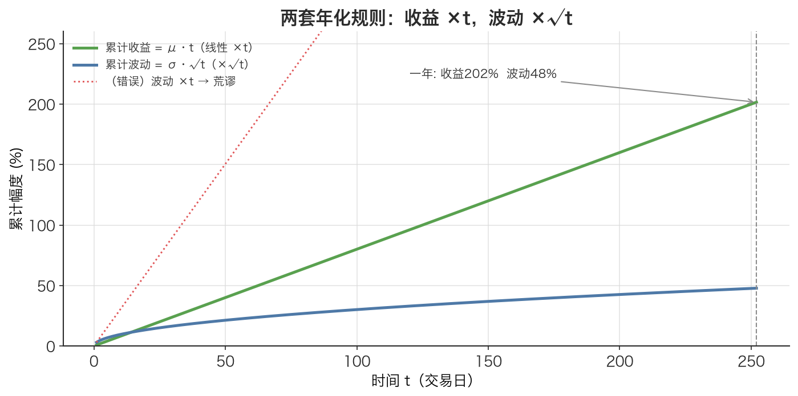

# 年化 Annualization

> 把「每天赚多少、每天波动多少」翻译成「一年赚多少、一年波动多少」，让不同周期的策略能放在同一把尺子上比较——但收益和波动用的不是同一把尺子。

## 1. 探底 · 确认前置知识

读这篇前，先确认能答上这几个自测题（答不上就先回去补）：

- [期望值 Expected Value](./ch01-03-expected-value.md)：随机变量的概率加权平均。自测：日均对数收益率 $\mu_{\text{daily}}$ 本质上是一组日收益率的什么统计量？
- [标准差 Standard Deviation](./ch01-05-standard-deviation.md)：方差的平方根，与原变量同量纲。自测：标准差为什么不能像均值那样直接相加？
- [对数收益率 Log Return](./ch01-09-log-return.md)：$r = \ln(P_t / P_{t-1})$。自测：为什么年化收益率用的是日收益率而不是日价格？
- [对数收益的时间可加性 Time-Additivity of Log Returns](./ch01-10-log-return-additivity.md)：自测：连续 252 天的总对数收益率，等于 252 个日对数收益率的什么运算结果？

如果「期望值是加权平均」「标准差按 $\sqrt{n}$ 缩放」这两句不能脱口而出，先回到 [期望值 Expected Value](./ch01-03-expected-value.md) 和 [标准差 Standard Deviation](./ch01-05-standard-deviation.md)。

## 2. 建立动机 · 为什么需要它？

假设回测了两个策略：

- 策略 A：日均对数收益率 0.05%，日波动率 0.8%。
- 策略 B：月均对数收益率 1.1%，月波动率 4%。

哪个更好？直接比 0.05% 和 1.1% 是错的——一个是「天」一个是「月」，量纲不同，根本不能比。就像不能用「每秒走 1 米」和「每小时走 3 公里」直接比谁快，必须先换算到同一单位。

更隐蔽的坑：**收益和波动的换算系数不一样**。新手最常见的错误是看到「日 → 年要乘 252」，于是把日波动率也乘 252，算出一个荒谬的「年化波动率 200%」，然后据此判断策略风险高得离谱、不敢上线，错过了一个其实很稳健的策略。年化用错系数，比不年化更危险。

年化（annualization）就是把任意周期的统计量统一换算到「一年」这个标准尺度的操作，是所有收益/风险指标（年化收益、年化波动、夏普比率）的共同地基。

## 3. 建立直觉 · 它「感觉上」是什么？

把一年想象成 252 个交易日叠在一起（A 股一年约 252 个交易日，去掉周末和节假日）。

**收益是「累加」的。** 对数收益率天生可加（见 [对数收益的时间可加性 Time-Additivity of Log Returns](./ch01-10-log-return-additivity.md)）：每天平均赚 $\mu_{\text{daily}}$，攒 252 天，总共就是 $252 \times \mu_{\text{daily}}$。这就像每天往罐子里放固定数量的硬币，一年后罐子里的硬币数 = 每天数量 × 天数。所以收益年化是**乘以 252**。

**波动是「抵消」的。** 波动率衡量的是「每天涨跌幅的分散程度」。如果每天的涨跌是独立的、有时正有时负，它们会互相部分抵消——不会简单地 252 倍放大。统计学告诉我们：n 个独立随机变量加起来，总和的标准差只放大 $\sqrt{n}$ 倍，不是 n 倍。这就像 252 个人各自随机往左或往右走一步，整体并不会偏出 252 步，而是大约偏出 $\sqrt{252} \approx 16$ 步。所以波动年化是**乘以 $\sqrt{252}$**。

一句话直觉：**收益乘以时间，波动乘以时间的平方根。** 这正是 [时间平方根法则 Square-Root-of-Time Rule](./ch01-13-sqrt-time-rule.md)的核心。



*图：随时间 t 累积，收益按 t 线性上升（绿，乘 252），波动按 √t 上升（蓝，乘 √252≈15.87）。红色虚线是「错误地把波动也乘 t」的结果——会得到荒谬的数字。收益乘时间、波动乘时间的平方根，这是两套不同的放大规则。*

## 4. 给出定义 · 它精确是什么？

设日频对数收益率序列的均值为 $\mu_{\text{daily}}$、标准差为 $\sigma_{\text{daily}}$，一年交易日数 $N = 252$。

**年化收益率**（annualized return）：

$$\mu_{\text{annual}} = \mu_{\text{daily}} \times N \qquad (N = 252)$$

**年化波动率**（annualized volatility）：

$$\sigma_{\text{annual}} = \sigma_{\text{daily}} \times \sqrt{N} \qquad (\sqrt{252} \approx 15.87)$$

符号说明：

| 符号 | 含义 | 单位 |
|------|------|------|
| $\mu_{\text{daily}}$ | 日均对数收益率，一组日 [对数收益率 Log Return](./ch01-09-log-return.md) 的均值 | 无量纲（小数，如 0.0005） |
| $\sigma_{\text{daily}}$ | 日波动率，日对数收益率的标准差 | 无量纲（小数） |
| $N$ | 一年交易日数，A 股约定为 252 | 天 |
| $\mu_{\text{annual}}$ | 年化对数收益率 | 无量纲（小数，乘 100 得百分比） |
| $\sigma_{\text{annual}}$ | 年化波动率 | 无量纲（小数） |

为什么收益用 N、波动用 $\sqrt{N}$？因为对数收益可加，所以 N 天总收益的期望 = N × 单日期望；而 N 个独立同分布变量之和的方差 = N × 单日方差，对方差开根号得标准差，于是标准差只放大 $\sqrt{N}$ 倍。一句话：**方差可加，标准差按 $\sqrt{t}$（时间的平方根）缩放。**

## 5. 例题演算 · 手把手算一遍

用本文配套代码「演示 1」的离散分布做一次完整年化。某股票明日对数收益率分布：

```text
收益率 x:  +5%   +2%    0%   -2%   -5%
概率   P:  0.20  0.35  0.15  0.20  0.10
```

**第 1 步，算日均收益率 $\mu_{\text{daily}}$（期望值）：**

$$\begin{aligned}
\mu_{\text{daily}} &= 0.05 \times 0.20 + 0.02 \times 0.35 + 0 \times 0.15 + (-0.02) \times 0.20 + (-0.05) \times 0.10 \\
        &= 0.0100 + 0.0070 + 0 - 0.0040 - 0.0050 \\
        &= 0.0080
\end{aligned}$$

即 0.8%/天。

**第 2 步，算日方差 Var：**

$$\begin{aligned}
\operatorname{Var} &= \sum (x - \mu)^2 \times P \\
    &= (0.05-0.008)^2 \times 0.20 + (0.02-0.008)^2 \times 0.35 + (0-0.008)^2 \times 0.15 \\
      &\quad + (-0.02-0.008)^2 \times 0.20 + (-0.05-0.008)^2 \times 0.10 \\
    &= (0.042)^2 \times 0.20 + (0.012)^2 \times 0.35 + (-0.008)^2 \times 0.15 \\
      &\quad + (-0.028)^2 \times 0.20 + (-0.058)^2 \times 0.10 \\
    &= 0.00035280 + 0.00005040 + 0.00000960 + 0.00015680 + 0.00033640 \\
    &= 0.00090600
\end{aligned}$$

**第 3 步，算日波动率 $\sigma_{\text{daily}}$：**

$$\sigma_{\text{daily}} = \sqrt{0.00090600} \approx 0.03010$$

即 3.01%/天。

**第 4 步，年化收益率（乘 252）：**

$$\mu_{\text{annual}} = 0.0080 \times 252 = 2.016$$

即 201.6%/年。

**第 5 步，年化波动率（乘 √252）：**

$$\begin{aligned}
\sqrt{252} &\approx 15.8745 \\
\sigma_{\text{annual}} &= 0.03010 \times 15.8745 \approx 0.4778
\end{aligned}$$

即 47.78%/年。注意：收益放大了 252 倍，波动只放大了约 15.87 倍。如果当初错把波动也乘 252，会算出 758% 的年化波动——这正是第 2 节说的危险错误。

## 6. 你来做 · 即时练习

1. 某策略日均对数收益率为 0.0004，日波动率为 0.012。求年化收益率和年化波动率（百分比，保留两位小数）。
2. 已知某品种年化波动率为 32%。请反推它的日波动率（提示：除以 √252）。
3. 概念题：如果一年按 250 个交易日算（而不是 252），年化收益率的换算系数和年化波动率的换算系数分别变成多少？哪个变化更大？

答案见文末折叠区。

## 7. 深化 · 边界与反常识

- **√252 不是 252 的一半。** 最常见的错误是把波动也乘 252。记住：方差才可加，标准差按 $\sqrt{t}$ 缩放（[时间平方根法则 Square-Root-of-Time Rule](./ch01-13-sqrt-time-rule.md)）。
- **平方根法则依赖「独立同分布」假设。** $\sigma_{\text{annual}} = \sigma_{\text{daily}} \times \sqrt{N}$ 的前提是每日收益独立且分布相同。真实市场存在波动率聚集（大涨大跌扎堆出现）和自相关，所以年化波动率只是一个**近似估计**，不是精确真理。趋势市场会让真实年化波动低于 $\sqrt{N}$ 估计，均值回归市场则相反。
- **收益年化对「对数 vs 简单」很敏感。** 本文收益年化用的是**对数**收益率均值 × 252，因为只有对数收益可加（[对数收益的时间可加性 Time-Additivity of Log Returns](./ch01-10-log-return-additivity.md)）。如果拿到的是简单收益率，正确的几何年化应是 $(1 + r_{\text{period}})^N - 1$，不能简单乘 N。混用会让长期回测的收益严重失真。
- **$\mu_{\text{annual}} = \mu_{\text{daily}} \times 252$ 给出的是「连续复利口径」的年化收益。** 想换成我们日常说的「一年涨百分之多少」（简单收益口径），要做 $e^{\mu_{\text{annual}}} - 1$。本例中 $e^{2.016} - 1 \approx 650\%$，这才是按净值算的年涨幅——可见对数口径和简单口径在高收益时差距巨大。
- 与近邻概念的区别：[复利效应 Compounding Effect](./ch01-11-compounding-effect.md)讲的是「钱滚钱」的非线性增长，年化则是把统计量换算到统一周期的「单位转换」操作，两者方向不同但都根植于对数收益的可加性。

## 8. 联系 · 它在数学地图里的位置

**上游依赖：**

- [期望值 Expected Value](./ch01-03-expected-value.md)→ 提供 $\mu_{\text{daily}}$（日均收益率）。
- [标准差 Standard Deviation](./ch01-05-standard-deviation.md)→ 提供 $\sigma_{\text{daily}}$（日波动率）。
- [对数收益率 Log Return](./ch01-09-log-return.md) 与 [对数收益的时间可加性 Time-Additivity of Log Returns](./ch01-10-log-return-additivity.md) → 解释了为什么收益年化能用「乘以 N」。
- [方差 Variance](./ch01-04-variance.md)的可加性 → 是平方根法则的根源。

**核心邻居：**

- [时间平方根法则 Square-Root-of-Time Rule](./ch01-13-sqrt-time-rule.md)→ 波动年化乘 √N 的一般化原理，年化只是它在 N=252 时的特例。

**下游用途：** 年化收益与年化波动是构造**夏普比率**（年化超额收益 / 年化波动）、最大回撤标注、跨策略横向比较的输入。

## 9. 应用 · 量化与算法交易在哪里用它？

年化几乎出现在每一份回测报告里。本文配套代码的真实做法：

```python
TRADING_DAYS = 252  # A股年交易日标准值

def annualise_return(daily_mean: float) -> float:
    """年化收益率：日均对数收益率 × 252（对数可加性）"""
    return daily_mean * TRADING_DAYS

def annualise_vol(daily_std: float) -> float:
    """年化波动率：日波动率 × √252（平方根法则）"""
    return daily_std * math.sqrt(TRADING_DAYS)
```

以及用 numpy/pandas 对沪深 300（前复权 qfq）真实数据的一行式年化：

```python
# close 是前复权收盘价序列；对数收益率，信号一律 shift(1) 避免未来数据
log_rets = np.log(close / close.shift(1)).dropna()
ann_ret = log_rets.mean() * 252          # 年化收益率：均值 × 252
ann_vol = log_rets.std()  * np.sqrt(252) # 年化波动率：标准差 × √252
```

真实场景：

- **策略评估与排序**：把日频、周频、月频策略的收益和波动都年化后，才能用夏普比率公平排序，决定资金分配。
- **风控限额**：风控系统常按「年化波动率上限」给策略设限（例如年化波动不得超过 25%）。实时监控时用滚动 20 日日波动 × √252 估算当前年化波动，超限就降仓——这正是本文练习 3 的滚动年化波动率思路。
- **回测报告标准化**：所有回测引擎（如本文用 akshare 取数后自建的流程）默认输出年化收益、年化波动，让不同时间跨度的回测结果可比。注意本文配套代码里手动实现与 numpy 的年化波动有极小差异，来自标准差的 ddof（自由度）不同（见 [贝塞尔校正（n-1） Bessel's Correction](./ch01-07-bessels-correction.md)）。

## 10. 复盘 · 用输出倒逼输入

能干净利落地回答下面三个问题，就说明你真的掌握了：

1. 为什么年化收益率乘 252，而年化波动率只乘 √252？背后的统计原理是什么？
2. 如果有人把日波动率乘以 252 来年化，结果会怎样？你怎么一眼看出这是错的？
3. 收益年化为什么必须用对数收益率而不是简单收益率？如果只有简单收益率该怎么办？

费曼式复述任务：用一句不含任何公式的大白话，向一个完全不懂数学的朋友解释——「为什么把每天的收益和波动换算成一年时，要用两种不同的放大倍数」。

---

<details>
<summary>第 6 节练习答案</summary>

1. $\mu_{\text{annual}} = 0.0004 \times 252 = 0.1008 = $ **10.08%**；$\sigma_{\text{annual}} = 0.012 \times \sqrt{252} = 0.012 \times 15.8745 \approx 0.1905 = $ **19.05%**。

2. $\sigma_{\text{daily}} = 0.32 / \sqrt{252} = 0.32 / 15.8745 \approx$ **0.02016（约 2.02%/天）**。

3. 收益系数：252 → 250，变化 2（绝对值 2）；波动系数：$\sqrt{252} \approx 15.8745 \to \sqrt{250} \approx 15.8114$，变化约 0.063。**收益系数变化更大**（因为它对 N 是线性的，波动对 N 是开根号的，开根号会压缩变化幅度）。这也解释了为什么 252 还是 250 在实务中影响有限——但同一份回测报告里必须前后统一，不能一处用 252 一处用 250。

</details>