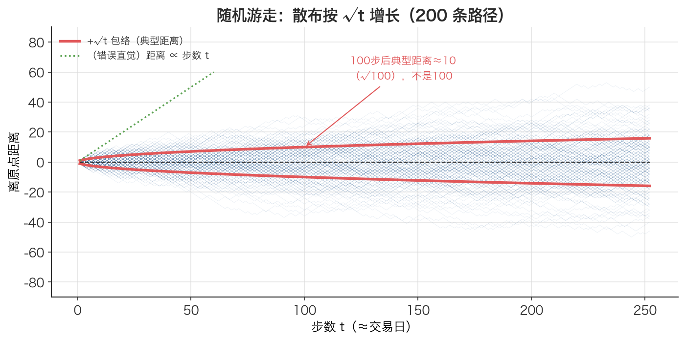

# 时间平方根法则 Square-Root-of-Time Rule

> 收益率随时间线性累加，但波动率（标准差）只随时间的平方根累加——所以日波动率年化要乘 √252，不是乘 252。

## 1. 探底 · 确认前置知识

读这篇前，先确认下面几个概念都点头：

- [方差 Variance](./ch01-04-variance.md)—— 自测：方差和标准差是同一个东西吗？哪个跟原数据同量纲？
- [标准差 Standard Deviation](./ch01-05-standard-deviation.md)—— 自测：波动率在金融里指的是均值还是标准差？
- [年化 Annualization](./ch01-12-annualization.md)—— 自测：把日均对数收益率年化为什么是乘 252？
- [对数收益率 Log Return](./ch01-09-log-return.md)+ [对数收益的时间可加性 Time-Additivity of Log Returns](./ch01-10-log-return-additivity.md)—— 自测：$\ln(P_3/P_1)$ 等于哪两段相加？
- 一点点独立同分布（i.i.d.）的概念 —— 自测：两个独立随机变量相加，它们的方差是相加还是相乘？

最后一条是本篇的钥匙：**独立随机变量相加，方差相加**。如果这条不确定，下面第 4 节会补。

## 2. 建立动机 · 为什么需要它？

假设写了个策略，回测得到沪深300的**日波动率是 1%**。现在风控同事问："这资产一年的波动率大概多少？"

最自然的错误是：一年 252 个交易日，那年化波动率 $= 1\% \times 252 = 252\%$？这显然荒谬——一年波动 252% 意味着资产一年内常态化翻倍或归零。

第二个看似聪明的错误：那就别乘 252，直接报 1% 吧？也不对——日波动和年波动差着两个数量级，拿日波动率去跟"年化夏普"、"年化目标波动率"做比较，单位对不上，整个风险预算全乱。

正确答案是 **$1\% \times \sqrt{252} \approx 15.87\%$**。

这个 √252 不是凑出来的经验系数，而是从"收益率近似随机游走"这个假设里**推导**出来的。搞错它，所有年化风险指标（年化波动、年化夏普、VaR 时间换算、目标波动率仓位）会系统性地高估或错配。这是量化里最高频被用、也最高频被搞错的一个换算。

## 3. 建立直觉 · 它「感觉上」是什么？

想象一个醉汉从路灯下出发，每秒随机往左或往右迈一步，步长固定。

- 走 **1 步**后，他离原点的"典型距离"是 1 个步长。
- 走 **4 步**后，也许会猜是 4 个步长？不是。因为左右随机抵消，他离原点的典型距离只有 **2** 个步长（$\sqrt{4}$）。
- 走 **100 步**后，典型距离是 **10** 个步长（$\sqrt{100}$），而不是 100。

关键在"随机抵消"：每一步的方向独立，正负互相消，所以**位置的散布（标准差）增长得比步数慢**——慢到正好是步数的平方根。

把"步数"换成"天数"、"离原点的散布"换成"收益率的波动"，就是时间平方根法则。期望（漂移）是定向的，会**线性**累加；波动是随机的，会按 **$\sqrt{t}$** 累加。这就是为什么均值年化乘 252，而波动年化乘 $\sqrt{252}$——它们走的是两套累加规则。



*图：200 条随机游走路径（醉汉走路，每步随机 ±1）。橙色是 ±√t 包络线——路径的散布正好被它罩住：走 100 步后离原点的典型距离约 10（√100）而不是 100。绿色虚线是「以为距离正比于步数 t」的错误直觉。这正对应「波动按时间平方根、而非线性累加」。*

## 4. 给出定义 · 它精确是什么？

设单期（如单日）对数收益率序列为 $r_1, r_2, \dots, r_t$，假设它们**独立同分布**，单期方差为 $\sigma^2$、单期标准差为 $\sigma$。

t 期的总对数收益率（用了[对数收益的时间可加性 Time-Additivity of Log Returns](./ch01-10-log-return-additivity.md)）：

$$R_t = r_1 + r_2 + \dots + r_t$$

因为独立随机变量相加、方差相加：

$$\operatorname{Var}(R_t) = \operatorname{Var}(r_1) + \dots + \operatorname{Var}(r_t) = t \cdot \sigma^2$$

两边开平方，得到 **t 期波动率**（时间平方根法则）：

$$\sigma(R_t) = \sqrt{t \cdot \sigma^2} = \sigma \cdot \sqrt{t}$$

各符号含义与单位：

| 符号 | 含义 | 单位 |
|------|------|------|
| $\sigma$ | 单期（日）收益率标准差，即日波动率 | 无量纲（收益率本身无量纲） |
| $t$ | 期数（如 252 表示一年的交易日数） | 期（天） |
| $\sigma \cdot \sqrt{t}$ | t 期累计的波动率 | 无量纲 |

年化特例（取 $t = 252$，本文约定 A股一年 252 个交易日）：

$$\sigma_{\text{annual}} = \sigma_{\text{daily}} \times \sqrt{252} \approx \sigma_{\text{daily}} \times 15.87$$

对照漂移项（均值）的累加是线性的：$\mu_{\text{annual}} = \mu_{\text{daily}} \times 252$。**两套规则不要混用**：均值乘 t，波动乘 $\sqrt{t}$。

## 5. 例题演算 · 手把手算一遍

沿用本文配套代码「演示 1」的离散分布——某股票明日收益率：

```text
收益率 x:  +5%   +2%    0%   -2%   -5%
概率   P:  0.20  0.35  0.15  0.20  0.10
```

**第 1 步：算期望 $\mu$**（[期望值 Expected Value](./ch01-03-expected-value.md)）

$$\begin{aligned}
\mu &= 0.05 \cdot 0.20 + 0.02 \cdot 0.35 + 0 \cdot 0.15 + (-0.02) \cdot 0.20 + (-0.05) \cdot 0.10 \\
  &= 0.010 + 0.007 + 0 - 0.004 - 0.005 \\
  &= 0.008
\end{aligned}$$

**第 2 步：算方差 Var**（[方差 Variance](./ch01-04-variance.md)，逐项 $(x-\mu)^2 \cdot P$，$\mu=0.008$）

$$\begin{aligned}
(0.05-0.008)^2 \cdot 0.20 &= (0.042)^2 \cdot 0.20 = 0.001764 \cdot 0.20 = 0.0003528 \\
(0.02-0.008)^2 \cdot 0.35 &= (0.012)^2 \cdot 0.35 = 0.000144 \cdot 0.35 = 0.0000504 \\
(0.00-0.008)^2 \cdot 0.15 &= (-0.008)^2 \cdot 0.15 = 0.000064 \cdot 0.15 = 0.0000096 \\
(-0.02-0.008)^2 \cdot 0.20 &= (-0.028)^2 \cdot 0.20 = 0.000784 \cdot 0.20 = 0.0001568 \\
(-0.05-0.008)^2 \cdot 0.10 &= (-0.058)^2 \cdot 0.10 = 0.003364 \cdot 0.10 = 0.0003364 \\
\operatorname{Var} &= 0.0009060
\end{aligned}$$

**第 3 步：日波动率 $\sigma = \sqrt{\operatorname{Var}}$**

$$\sigma_{\text{daily}} = \sqrt{0.0009060} \approx 0.03010$$

即 3.01%。

**第 4 步：应用时间平方根法则年化**

$$\sigma_{\text{annual}} = \sigma_{\text{daily}} \times \sqrt{252} = 0.03010 \times 15.8745 \approx 0.4778$$

即 47.78%。

**对照**：日均收益率 $\mu=0.8\%$ 年化是 $0.008 \times 252 = 2.016 \approx 201.6\%$（线性），而波动率年化只是 47.78%（$\sqrt{t}$）。注意两者数量级差异——这正是两套规则的体现。

## 6. 你来做 · 即时练习

1. 某资产日波动率 $\sigma_{\text{daily}} = 1.5\%$。用平方根法则求年化波动率（$\sqrt{252} \approx 15.87$）。
2. 把"年"换成"月"：假设一个月有 21 个交易日，日波动率 2%，求月波动率。
3. 反向题：某基金年化波动率为 20%，假设满足平方根法则且一年 252 天，反推它的日波动率约为多少？

答案见文末折叠区。

## 7. 深化 · 边界与反常识

**反常识点**：方差线性累加，标准差按 $\sqrt{t}$ 累加。很多人凭直觉给标准差也乘 t，这就是 1% 年化成 252% 的来源。永远先回到方差再开方。

**何时失效**：

- **自相关 / 不独立**：平方根法则的前提是各期独立。若收益有正自相关（动量、趋势），实际波动**大于** $\sigma \cdot \sqrt{t}$；若负自相关（均值回复），实际波动**小于** $\sigma \cdot \sqrt{t}$。高频数据、有微观结构噪声时尤其要警惕。
- **波动率聚集（异方差）**：真实市场 $\sigma$ 并非常数（GARCH 现象，危机期 $\sigma$ 飙升），$\sigma$ 不再是单一值，简单乘 $\sqrt{t}$ 只是粗略近似。
- **用错收益率**：法则建立在**可加的对数收益率**上（见 [对数收益的时间可加性 Time-Additivity of Log Returns](./ch01-10-log-return-additivity.md)）。简单收益率不可加，套这条规则不严格。
- **肥尾**：法则只管二阶矩（方差），不保证分布形状随时间不变；尾部风险（如 VaR）做 $\sqrt{t}$ 缩放会低估极端损失。

**常见误解**：以为 $\sqrt{t}$ 法则也适用于均值。不——均值（漂移）是确定性方向累加，走的是线性 $\times t$，见 [年化 Annualization](./ch01-12-annualization.md)。

## 8. 联系 · 它在数学地图里的位置

**上游依赖**：

- [方差 Variance](./ch01-04-variance.md)/ [标准差 Standard Deviation](./ch01-05-standard-deviation.md)—— 法则本质是"方差线性可加"的推论。
- [对数收益的时间可加性 Time-Additivity of Log Returns](./ch01-10-log-return-additivity.md)—— 提供"t 期收益 = 各期相加"这一步。
- 独立同分布假设 —— 没有独立性，方差不能简单相加。

**下游用途**：

- [年化 Annualization](./ch01-12-annualization.md)—— 波动率年化的那一半（另一半是均值线性年化）就是本法则。
- 夏普比率年化、VaR 的时间换算、目标波动率仓位管理，全部依赖它。

本法则是从 [方差 Variance](./ch01-04-variance.md) 通向"风险年化"这条主干路上的关键一跳。

## 9. 应用 · 量化与算法交易在哪里用它？

本文配套代码在「使用库」一段就直接用了它来年化沪深300真实数据的波动率：

```python
# 对数收益率（一行实现，信号需 shift(1) 延迟一天执行）
log_rets = np.log(close / close.shift(1)).dropna()

# 年化统计：均值乘 252（线性），波动乘 √252（平方根法则）
ann_ret = log_rets.mean() * 252
ann_vol = log_rets.std() * np.sqrt(252)
```

注意三处对齐本文规则的细节：用**对数收益率**（可加，法则才严格成立）；价格用**前复权（qfq）**下载；计算用 `close.shift(1)`，绝不引入未来数据。手动实现里对应的封装是：

```python
def annualise_vol(daily_std: float) -> float:
    """年化波动率：日波动率 × √252（平方根法则）"""
    return daily_std * math.sqrt(TRADING_DAYS)  # TRADING_DAYS = 252
```

真实场景：

- **风控 / 风险预算**：把日波动换算成年化波动，才能跟"年化目标波动 15%"之类的约束比较，进而决定仓位。
- **滚动波动率监控**（见本文练习 3）：每天用过去 20 日对数收益的标准差 × √252，得到滚动年化波动率，识别市场进入高波动状态。
- **夏普比率年化**：年化夏普 = (日均超额收益 × 252) / (日波动 × √252) = 日夏普 × √252——分子分母用的正是两套不同的累加规则。
- **不同频率策略对比**：把日频、周频策略的波动统一换算到同一时间尺度，否则无法横向比较。

## 10. 复盘 · 用输出倒逼输入

能脱口而出下面三问，就算掌握了：

1. 为什么波动率年化乘 √252，而收益率年化乘 252？（答到"方差线性可加、标准差是方差开方"才算到位。）
2. 平方根法则的核心假设是什么？哪种市场情形（自相关）会让它高估、哪种会让它低估实际波动？
3. 给定年化波动率 20%，怎么反推日波动率？（√t 法则的逆运算。）

**费曼式复述任务**：用"醉汉走路"的类比，向一个只懂高中数学的朋友讲清楚——为什么走 100 步后离原点的典型距离是 10 步而不是 100 步，以及这跟"日波动率年化乘 √252"是同一件事。

---

<details>
<summary>第 6 节练习答案</summary>

1. $1.5\% \times \sqrt{252} = 1.5\% \times 15.87 \approx 23.81\%$。
2. $2\% \times \sqrt{21} = 2\% \times 4.583 \approx 9.17\%$。
3. 反向就是除以 $\sqrt{252}$：$20\% / 15.87 \approx 1.26\%$。（公式 $\sigma_{\text{daily}} = \sigma_{\text{annual}} / \sqrt{252}$。）

</details>