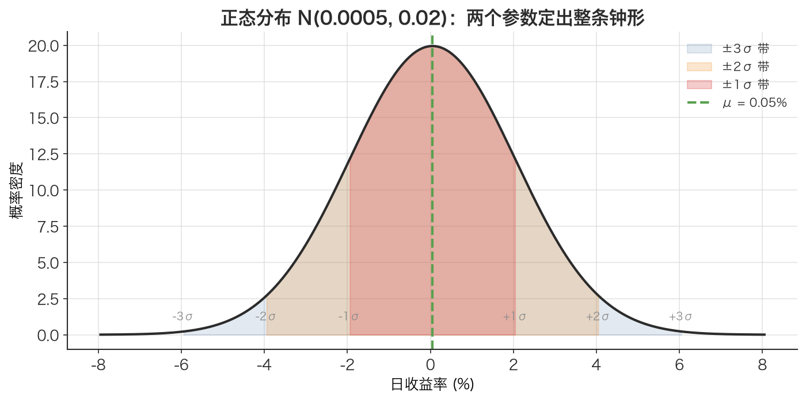
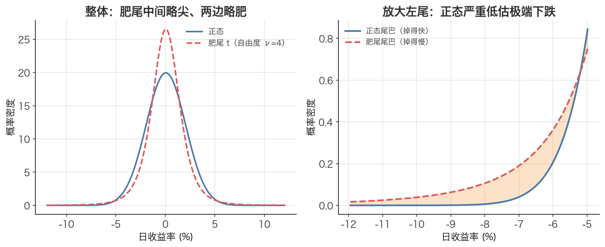

# 正态分布 Normal Distribution

> 它是金融建模里最有用的「谎言」：用两个数（$\mu$ 和 $\sigma$）就能描述整条钟形曲线——好用到让人忘了它在极端行情下会骗你。

## 1. 探底 · 确认前置知识

读这篇前，请确认下面三个概念你都「能用自己的话讲清楚」：

- [概率分布 Probability Distribution](./ch01-02-probability-distribution.md)——自测：连续随机变量的概率为什么要用「面积」而不是「某点的高度」来表示？
- [期望值 Expected Value](./ch01-03-expected-value.md)——自测：给你一组日收益率，期望值 $\mathbb{E}[X]$ 对应的是哪个统计量？它和「均值」是一回事吗？
- [标准差 Standard Deviation](./ch01-05-standard-deviation.md)——自测：标准差 $\sigma$ 和方差 $\sigma^2$ 的单位分别是什么？为什么 $\sigma$ 更适合和收益率放在一起比较？

如果某条答不上来，先回去补，否则本篇的公式会变成天书。

## 2. 建立动机 · 为什么需要它？

假设管理一个沪深300指数组合，老板问：「明天最多可能亏多少？」此时需要一个能把「未来收益率的不确定性」压缩成可计算数字的模型。

最省事的假设是：日收益率服从正态分布。只要估出均值 $\mu$ 和标准差 $\sigma$，就能算出「亏损超过 3% 的概率」「99% 情况下损失不超过多少」（这就是在险价值 VaR）。整个现代金融工程——期权定价、组合优化、风险预算——最早都是从这个假设起步的。

痛点在于：正态分布把极端事件的概率压得极低。在正态假设下，单日跌幅超过 $4\sigma$ 的概率约 0.006%，几十年才该出现一次。但 A 股 2015 年股灾期间，单日跌超 8%（远超 $4\sigma$）的情形在数月内反复出现。2008 年高盛 CFO 那句「连续遭遇 25 个标准差事件」——在正态假设下概率约 $10^{-137}$，比宇宙原子总数的倒数还小——说明的不是运气差，而是**模型错了**。

所以必须先彻底搞懂正态分布：它是一切的基准，也是后面学 [学生 t 分布 Student's t-distribution](./ch02-11-students-t.md)、[肥尾 Fat Tails](./ch02-10-fat-tails.md)、[峰度 Kurtosis](./ch02-08-kurtosis.md) 时要对照、要超越的那个「错误但有用」的起点。

## 3. 建立直觉 · 它「感觉上」是什么？

想象一万个人各自往墙上随机扔飞镖瞄准同一个红心。绝大多数飞镖会落在红心附近，离得越远的越少，左右大致对称。把落点的横向偏差画成直方图，会得到一座**对称的钟形山丘**：中间最高，两边平滑下滑，理论上无限延伸但越来越贴近地面。

这就是正态分布的形状。它的「感觉」由两件事决定：

- **$\mu$（中心在哪）**：山峰的位置。$\mu$ 变大，整座山向右平移。
- **$\sigma$（山有多胖）**：$\sigma$ 大，山矮而宽（不确定性大，分散）；$\sigma$ 小，山高而瘦（数据挤在均值附近）。

关键直觉：**正态分布的尾巴衰减得非常快**（按 e 的负平方衰减）。离中心每远一个 $\sigma$，概率就断崖式下跌。这正是它低估极端事件的根源——现实市场的尾巴是「肥」的，下降得比这慢得多（见 [肥尾 Fat Tails](./ch02-10-fat-tails.md)）。

记住一组数字（[68-95-99.7 法则 The 68-95-99.7 Rule](./ch02-05-empirical-rule.md)）：落在 $\mu \pm \sigma$ 内约 68%，$\mu \pm 2\sigma$ 内约 95%，$\mu \pm 3\sigma$ 内约 99.7%。



*图：N(0.0005, 0.02) 的钟形曲线，由内到外是 ±1σ/±2σ/±3σ 三档带。注意每往外走一个 σ，曲线高度就断崖式下跌——这正是正态尾巴衰减极快的样子。*



*图：左图把正态和同方差的肥尾 t 分布叠在一起，肥尾「中间略尖、两边略肥」；右图放大左尾，橙色阴影就是正态相对肥尾「少算」的极端下跌概率——正态系统性低估极端事件，根源就在这里。*

## 4. 给出定义 · 它精确是什么？

若随机变量 X 服从均值 $\mu$、方差 $\sigma^2$ 的正态分布，记作 $X \sim N(\mu, \sigma^2)$，其概率密度函数（[PDF Probability Density Function](./ch02-02-pdf.md)）为：

$$
f(x) = \frac{1}{\sigma\sqrt{2\pi}} \cdot \exp\left(-\frac{(x - \mu)^2}{2\sigma^2}\right)
$$

逐符号拆解：

- $x$：自变量，本文里通常是「某日的对数收益率」，无量纲（或视作比例）。
- $\mu$（mu，均值）：分布中心，单位与 $x$ 相同（如收益率）。等于 [期望值 Expected Value](./ch01-03-expected-value.md) $\mathbb{E}[X]$。
- $\sigma$（sigma，[标准差 Standard Deviation](./ch01-05-standard-deviation.md)）：控制胖瘦，单位与 $x$ 相同。$\sigma^2$ 是方差。
- $\frac{1}{\sigma\sqrt{2\pi}}$：归一化系数，保证整条曲线下面积 = 1（这是任何 [概率密度函数 PDF Probability Density Function](./ch02-02-pdf.md) 的硬性要求）。
- $\exp\left(-\frac{(x-\mu)^2}{2\sigma^2}\right)$：钟形的来源。指数里是「标准化距离的平方」，离 $\mu$ 越远，负得越多，密度掉得越快。

当 $\mu=0$、$\sigma=1$ 时称为**标准正态分布** $N(0,1)$，其密度记作 $\varphi(x)$，累积分布（[CDF Cumulative Distribution Function](./ch02-03-cdf.md)）记作 $\Phi(x)$。任意正态变量都可通过标准化 $z = (x - \mu)/\sigma$ 转成标准正态——$z$ 就是「偏离均值几个标准差」，是连接一切的桥梁。

## 5. 例题演算 · 手把手算一遍

**题目**：标准正态分布 $N(0,1)$，求密度峰值 $f(0)$，并验证它约等于 0.3989。这正是本文配套代码里 `normal_pdf` 的自测用例。

代入 $\mu=0$、$\sigma=1$、$x=0$：

1. 系数部分：$1/(\sigma\sqrt{2\pi}) = 1/(1 \cdot \sqrt{2\pi})$。
2. 计算 $\sqrt{2\pi}$：$2\pi \approx 6.2832$，$\sqrt{6.2832} \approx 2.5066$。
3. 所以系数 $\approx 1/2.5066 \approx 0.3989$。
4. 指数部分：$\exp(-0.5 \cdot ((0-0)/1)^2) = \exp(0) = 1$。
5. 相乘：$f(0) = 0.3989 \times 1 = 0.3989$。✓

**再算一个有金融味的**：某 A 股日对数收益率近似 $N(\mu=0.0005, \sigma=0.02)$。问「明天收益率落在 0.0005 到 0.0205 之间」相对「正好等于均值」时，密度衰减了多少？取 $x = \mu + \sigma = 0.0205$：

1. 标准化：$z = (x - \mu)/\sigma = (0.0205 - 0.0005)/0.02 = 1$。
2. 指数：$\exp(-0.5 \cdot z^2) = \exp(-0.5 \cdot 1^2) = \exp(-0.5) \approx 0.6065$。
3. 即「偏离 1 个 $\sigma$」处的密度高度，只剩峰值的约 **60.65%**。这和直方图肉眼看到的「钟形从顶往下滑」一致。

## 6. 你来做 · 即时练习

1. 已知 $X \sim N(\mu=2, \sigma=3)$，把 $x=8$ 标准化成 $z$ 值。
2. 用 68-95-99.7 法则估计：$X \sim N(0, 1)$ 落在区间 $[-2, 2]$ 之内的概率约是多少？落在区间之外（两条尾巴合计）呢？
3. 某策略日收益率近似 $N(\mu=0.001, \sigma=0.015)$。粗略用「$3\sigma$ 法则」估计：哪个收益率水平大约对应「99.7% 的日子都不会跌破」的下界？

答案见文末折叠区。

## 7. 深化 · 边界与反常识

- **「正态分布能允许价格为负」**：正态分布的取值范围是整条实数轴 $(-\infty, +\infty)$。直接用它建模**股价**会得到「负价格」这种荒谬结论。正确做法是建模**对数收益率**用正态，建模**价格**用 [对数正态分布 Lognormal Distribution](./ch02-06-lognormal-distribution.md)（价格永远为正）。一句口诀：**价格用对数正态，收益率用正态或 t 分布。**
- **「峰高 = 尖就是正态」**：误区。正态分布的标志不是「尖」，而是**尾部按 $e^{-x^2}$ 这种超快速度衰减**。真实收益率往往「中间更尖、两边也更肥」（[超额峰度 Excess Kurtosis](./ch02-09-excess-kurtosis.md) $> 0$），这恰恰**不是**正态。
- **对称性是个强假设**：正态分布偏度（[Skewness](./ch02-07-skewness.md)）严格为 0，左右对称。但股灾时「暴跌比暴涨更猛」，收益率分布常左偏，正态抓不住。
- **何时失效**：极端尾部、危机时刻、高频数据。此时换 [学生 t 分布 Student's t-distribution](./ch02-11-students-t.md)（多一个自由度参数 $\nu$ 来加厚尾部），用 Jarque–Bera 检验能否拒绝正态、用 Q–Q 图看尾部偏离方向。
- **何时够用**：长周期（如月度、年度）收益率、组合层面的聚合量，因中心极限定理常更接近正态——但**不要**把它当成铁律。

## 8. 联系 · 它在数学地图里的位置

**上游依赖**：要理解正态分布，先得有 [概率分布 Probability Distribution](./ch01-02-probability-distribution.md)（它是一种连续分布）、[期望值 Expected Value](./ch01-03-expected-value.md)（参数 μ）、[标准差 Standard Deviation](./ch01-05-standard-deviation.md)（参数 σ）。它的曲线本身就是一个 [概率密度函数 PDF Probability Density Function](./ch02-02-pdf.md)，累积起来得到 [累积分布函数 CDF Cumulative Distribution Function](./ch02-03-cdf.md)，取逆得到 [分位数 Quantile](./ch02-04-quantile.md)（VaR 计算的核心工具）。

**下游用途与近邻**：
- [68-95-99.7 法则 The 68-95-99.7 Rule](./ch02-05-empirical-rule.md)是它的直接推论。
- [对数正态分布 Lognormal Distribution](./ch02-06-lognormal-distribution.md) = 「取对数后是正态」，专门建模价格。
- [学生 t 分布 Student's t-distribution](./ch02-11-students-t.md)是它的「肥尾推广」，$\nu \to \infty$ 时退回正态。
- [峰度 Kurtosis](./ch02-08-kurtosis.md) / [超额峰度 Excess Kurtosis](./ch02-09-excess-kurtosis.md) / [偏度 Skewness](./ch02-07-skewness.md) 是「偏离正态多远」的度量；Jarque–Bera 检验把它们组合成正态性检验。
- 在险价值 VaR / 条件在险价值 CVaR 风险度量、Q–Q 图诊断、最大似然估计 MLE 参数拟合，都以正态为基准对照对象。

## 9. 应用 · 量化与算法交易在哪里用它？

正态分布在本文配套代码中扮演「基准 / 对照组」的角色，几乎所有分析都是「正态 vs 现实」的对比：

- **风控里的正态 VaR**：`normal_var(returns, conf=0.99)` 用 `−(μ + norm.ppf(1−conf)·σ)` 计算正态假设下的 99% 在险价值（VaR）。这里 `norm.ppf` 就是正态 [累积分布函数 CDF Cumulative Distribution Function](./ch02-03-cdf.md) 的逆——求 [分位数 Quantile](./ch02-04-quantile.md)。它给出风险准备金的「乐观估计」。
- **暴露低估的证据**：本文配套代码把它和 `t_var`（[学生 t 分布 Student's t-distribution](./ch02-11-students-t.md) 拟合的 VaR）放一起对比，典型结果是 99% 时 t 分布 VaR 比正态高 30–50%。结论很直接：**只用正态做风控，会系统性少备风险金，极端行情下爆仓。**
- **尾部概率核对**：代码用 `2*(1 − norm.cdf(k))` 算正态下超过 k 个 σ 的理论概率，再与历史实际频率比。3σ、4σ 处的实际频率往往是正态预测的好几倍——量化「正态低估极端事件」有多严重。
- **可视化诊断**：`stats.probplot(returns, dist="norm")` 画 Q–Q 图，点偏离对角线说明真实分布的尾巴比正态肥；PDF 对比图里那条红色 `normal_pdf` 曲线就是基准钟形。

写策略 / 回测时的纪律提醒：用收益率拟合分布算 VaR、生成交易信号时，特征与信号一律 `shift(1)`，绝不能用当日（未来）数据回看；A 股数据统一取**前复权(qfq)**，否则除权日会制造假尾部。下面是一段贴合本文配套代码风格的最小用法示例：

```python
import numpy as np
from scipy.stats import norm

# returns 已是「前复权收盘价」算出的对数收益率，且建模/回测中用 shift(1) 错开
mu = np.mean(returns)
sigma = np.std(returns, ddof=1)

# 正态 99% VaR（正数=日损失幅度），作为风险基准线
var_normal = -(mu + norm.ppf(1 - 0.99) * sigma)
print(f"99% 正态 VaR ≈ {var_normal*100:.2f}%  （记住：这是乐观下限，真实尾部更肥）")
```

## 10. 复盘 · 用输出倒逼输入

能干净利落答出下面三个问题，就算掌握了：

1. 正态分布只用两个参数 $\mu$ 和 $\sigma$ 就能完全确定整条曲线——分别说出它们各自控制曲线的什么，并写出标准化变换 $z = ?$。
2. 为什么金融实践中「价格用[对数正态分布 Lognormal Distribution](./ch02-06-lognormal-distribution.md)、收益率用正态」？正态分布用在价格上会出什么荒谬结论？
3. 正态假设在风控（在险价值 VaR）中最危险的失效点在哪里？本文配套代码用哪两类对比（VaR 比值、尾部频率）来揭示它？

**费曼式复述任务**：用不超过 5 句话，向一个只会编程、没学过金融的同事讲清楚：正态分布是什么、为什么量化里到处用它、以及它最大的「谎言」是什么。

---

<details>
<summary>第 6 节练习答案</summary>

1. $z = (8 - 2)/3 = 6/3 = 2$。即 8 落在均值右侧 2 个标准差处。
2. 落在 $[-2, 2]$ 内约 **95.4%**；落在外侧约 **4.6%**（每条尾巴约 2.3%）。
3. 下界 $\approx \mu - 3\sigma = 0.001 - 3\times0.015 = 0.001 - 0.045 = -0.044$，即约 **−4.4%**。注意：这是正态假设下的估计，真实肥尾会让更糟的日子比正态预测的更频繁——这正是下一节要破的局。

</details>